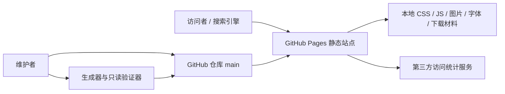
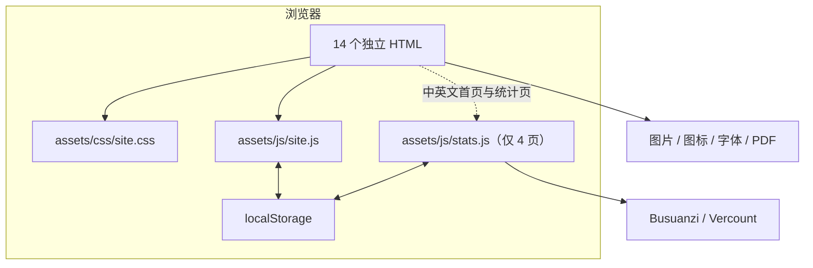
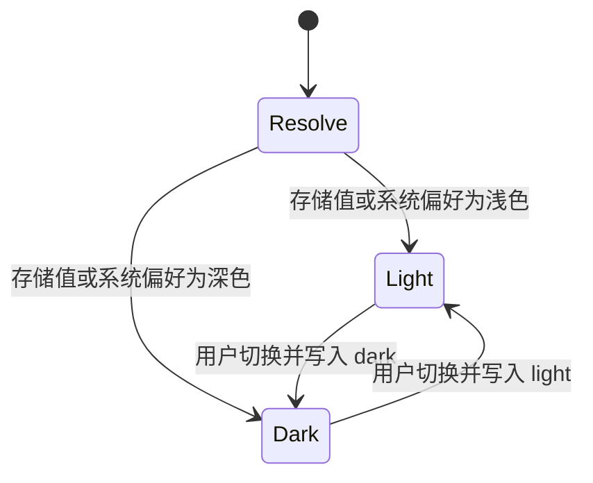
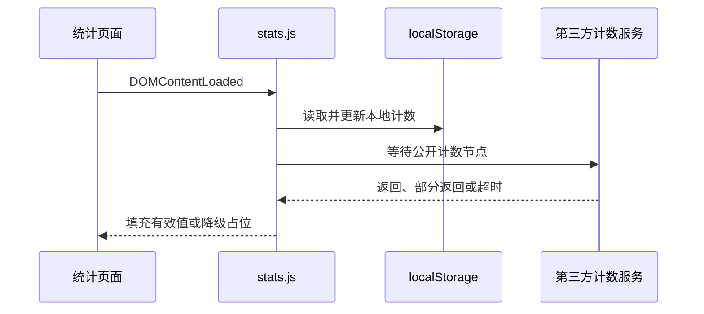

# 系统架构

本文是网站当前架构的唯一事实说明，回答“系统由什么组成、各部分如何协作、哪些约束不能破坏”。维护入口见[文档导航](README.md)，视觉规则见[设计规范](design.md)，验证方法见[测试规范](testing.md)，发布操作见[运维指南](operations.md)，已知偏差见[维护记录](maintenance.md)。

## 1. 事实源与边界

发生冲突时，按以下顺序判断当前事实：

1. 14 个实际 HTML 页面；
2. `assets/css/site.css`；
3. `assets/js/site.js` 与 `assets/js/stats.js`；
4. `manifest.webmanifest`、`manifest.en.webmanifest`、`robots.txt`、`sitemap.xml`；
5. `scripts/generate-sitemap.js`、`scripts/validate-site.js` 及其测试；
6. 本文及其他项目文档。

这是一个无构建步骤的双语静态站点。浏览器直接加载 HTML、CSS、JavaScript、图片、字体和公开下载材料；仓库的 `main` 分支由 GitHub Pages 发布。项目没有后端、数据库、服务端模板或包管理构建链。

系统边界包含：

- 中文与英文页面；
- 全站共享样式与交互；
- 仅部分页面加载的访问统计；
- favicon、品牌图、图片、字体和公开下载材料；
- SEO 元数据、站点清单、爬虫规则和 sitemap；
- 站点验证器与 sitemap 生成器。

系统边界不包含个人研究源文件、未发表研究材料、私有证明材料和服务端数据。凡进入 Git 仓库并由 Pages 发布的内容都应按公开信息处理。

## 2. 系统目标

网站需要同时满足四类目标：

- **内容可达**：中英文入口、研究、项目、档案、简历和统计页面可直接访问；
- **交互可用**：主题、移动导航、Lightbox 和统计降级在键盘与触屏环境下可用；
- **语义明确**：可索引页面提供稳定的 canonical、hreflang、社交元数据和结构化数据；
- **维护可控**：页面库存、资源路径、sitemap 与验证器保持同步，公开边界可以审计。



## 3. 页面库存与路由

站点固定包含 7 个中文 HTML 和 7 个英文 HTML。下表列出物理文件；中文、英文首页的 canonical 分别是 `/` 与 `/en/`，而不是 `/index.html` 与 `/en/index.html`。除 404 外，六组页面共 12 个可索引 URL。

| 页面组 | 中文文件 | 英文文件 | 主要职责 | 可索引 |
| --- | --- | --- | --- | --- |
| 首页 | `index.html` | `en/index.html` | 站点概览、研究入口、统计摘要 | 是 |
| 档案 | `profile.html` | `en/profile.html` | 时间线、经历、证明材料 | 是 |
| 研究 | `research.html` | `en/research.html` | 一般研究方向与方法说明 | 是 |
| 项目 | `projects.html` | `en/projects.html` | 项目与仓库入口 | 是 |
| 简历 | `resume.html` | `en/resume.html` | 网页简历与公开下载入口 | 是 |
| 统计 | `analytics.html` | `en/analytics.html` | 公开计数和本地计数 | 是 |
| 404 | `404.html` | `en/404.html` | Pages 回退、按路径原地本地化与语言对应跳转 | 否 |

双语页面共享视觉和交互合同，但当前档案页并非逐节点镜像：中文档案有独立的 `#gap-year` 阶段，英文将相同经历并入研究生阶段；两种语言的项目卡片数量也不同。维护文档应记录这一现状，不能声称 DOM 结构完全对称。内容是否需要重组属于单独的页面任务。

## 4. 容器与组件



### 4.1 HTML

每个页面独立维护 `<head>`、导航、主体和页脚。页面不依赖模板引擎，因此新增或改名页面时必须同步：

- 中英文页面库存；
- 导航与语言切换；
- canonical、hreflang、Open Graph、Twitter 与 JSON-LD；
- `sitemap.xml` 和两个维护脚本中的页面清单；
- 验证器测试与项目文档。

### 4.2 共享样式

`assets/css/site.css` 是唯一全站样式入口，负责设计令牌、布局、组件、响应式规则、主题状态和可访问性样式。当前移动导航边界是：

- `<= 833px`：隐藏桌面导航，启用移动抽屉；
- `> 833px`：显示桌面导航，关闭移动抽屉入口；整数像素视口从 834px 开始。

CSS 中的媒体查询按实际级联需要分布在多个位置，并非严格按尺寸集中排序；不能把“从大到小且不重复”写成已经成立的事实。

### 4.3 共享交互

`assets/js/site.js` 负责：

- 主题初始化、切换和持久化；
- 移动抽屉开启、关闭、`inert`、焦点陷阱、Escape 关闭和焦点归还；
- 图片 Lightbox 的打开、键盘导航、关闭和焦点管理；
- 页面渐入等增强效果。

主题写入根元素 `data-theme`，持久化键为 `ysb-theme`。脚本失效时，正文和导航仍应保持基本可读；交互增强不能成为内容访问的唯一入口。

### 4.4 品牌与图标

导航品牌标识是空的 `.brand-mark` 元素，通过 CSS 背景图加载 `assets/icons/brand-mark.png`。它不是 Font Awesome terminal 字形；页面以 16×16 显示该图，源 PNG 固定为 64×64 且不超过 16 KiB，为高像素密度屏幕保留四倍采样，同时避免加载未经缩放的设计母版。两份 manifest 的安装图标清单按 `src` 无序比较，必须精确包含 `app-icon-192.png` 与 `app-icon-512.png`：尺寸分别为 192×192 和 512×512，类型均为 `image/png`，用途均为 `any`，不声明 `maskable`。`assets/icons/site.ico` 独立承担 HTML favicon，内含不重复的 16×16、32×32、48×48、256×256 四个图层，不进入 manifest。Font Awesome 仅承担普通功能图标。

## 5. 状态模型

### 5.1 主题状态



### 5.2 移动抽屉状态

抽屉关闭时不应进入键盘焦点顺序；开启时焦点移入抽屉并被限制在可交互项内。点击遮罩、点击导航项或按 Escape 都会关闭抽屉，随后焦点返回菜单按钮。`site.js` 与 CSS 共享 `(max-width: 833px)` 移动谓词：打开抽屉后该查询从匹配变为不匹配时，复用关闭逻辑清理 `menu-open`、`inert`、遮罩和滚动锁，包括页面缩放产生的 `833px < width < 834px` 小数 CSS 视口；如果焦点位于移动菜单内，则转移到可见的当前桌面导航项；页面没有当前项时使用首个桌面导航链接，而不是已隐藏的菜单按钮。

### 5.3 Lightbox 状态

带 `data-lightbox` 的证明图可以打开覆盖层。打开后保存触发元素、锁定背景交互并支持 Escape；关闭时恢复页面状态和原焦点。图片本身仍保留普通链接语义，脚本不可用时可以直接打开原图。

## 6. 访问统计

`assets/js/stats.js` 只在四个页面加载：

- 中文首页；
- 英文首页；
- 中文统计页；
- 英文统计页。

因此本地累计访问只表示当前浏览器在这四个页面上的累计，不是 14 个页面的全站总访问量。其他页面既不加载统计脚本，也不应保留统计服务的专用依赖提示。

本地记录的规范键为 `ysb-visit-total`、`ysb-visit-first`、`ysb-visit-last` 和 `ysb-visit-days`。为兼容旧版内联统计脚本，`stats.js` 在更新本次访问前按字段检查以下历史键：

| 字段 | 规范键 | 历史键 | 兼容处理 |
| --- | --- | --- | --- |
| 累计次数 | `ysb-visit-total` | `ysb_visit_total` | 规范键缺失且旧值有效时迁移 |
| 首次访问 | `ysb-visit-first` | `ysb_first_visit` | 规范键缺失且旧值有效时迁移 |
| 最近访问 | `ysb-visit-last` | `ysb_last_visit` | 保留旧键但不复制；规范键直接记录本次访问 |
| 访问日期 | `ysb-visit-days` | `ysb_visit_days` | 规范键缺失且旧值有效时迁移 |

对三个可迁移字段，只有 `getItem(规范键) === null` 才表示规范键缺失；空字符串或损坏的现有规范值也不会被历史值覆盖。历史累计次数必须是无前导零的非负 ASCII 十进制串（`0` 除外），且本次递增后仍处于 JavaScript 安全整数范围；首次访问必须与 `toISOString()` 完全往返一致；访问日期必须是由不重复真实 `YYYY-MM-DD` 日期组成的 JSON 数组。单个迁移字段的历史读取、验证或写入失败时只跳过该字段，其他迁移字段仍独立检查，随后仍尝试本次更新；若 localStorage 持续不可用，则沿用本地计数可选降级。旧版和当前脚本都会在加载时把最近访问更新为现在，因此复制旧 `last` 只会产生一次立即被覆盖的冗余写入，明确不执行。兼容处理不删除或改写历史键，也不合并两套记录；`ysb-page:${pathname}` 是后来新增的页面计数，没有历史键映射。

规范累计计数 `ysb-visit-total` 与页面计数 `ysb-page:${pathname}` 只接受无前导零的非负 ASCII 十进制串，其中 `0` 是唯一允许以零开头的值。两个计数均按十进制字符串逐位精确加一，不把完整计数字符串转换为 JavaScript 数值，也不受安全整数或字符串长度上限约束；计数 helper 必须自包含，不依赖同文件其他函数，并且不得引用 `Number`、`parseInt`、`parseFloat` 或 `BigInt`，不得使用任意进制或带数字分隔符的 BigInt 字面量，也不得使用模板字面量。读取结果缺失、为空或不符合该形状时，本次访问统一从 `1` 重新建立；最终存储值与页面显示值必须一致。损坏的现有规范值仍不会回退到历史键。

规范访问历史在每次加载时使用同一个当前时间实例归一化。完成前述历史键迁移后，`ysb-visit-first` 只有在字符串能与 `new Date(value).toISOString()` 完全往返一致时才保留；迁移后仍缺失，或现有规范值为空、损坏、使用带时区偏移但非规范的表示或其他会被日期解析器自动修正的表示时，都以本次当前时间重建。`ysb-visit-last` 始终写入同一当前时间，因此首次访问被重建时，两者必须得到完全相同的 ISO 字符串。只有严格缺失的规范键能接收合法历史值，任何已经存在但无效的规范键都不得回退到历史键。`ysb-visit-days` 只保留严格的真实 `YYYY-MM-DD` 字符串：非数组、混合类型、无效日历日期与重复项会被清理；除今天外的合法日期按原顺序稳定去重，今天从原位置移除后唯一追加到末尾，随后保留最后 365 项。日期数组即使无需清洗也要在每次加载时持久化，最终存储的天数、首次/最近时间及页面显示必须互相一致。



公开计数通过隐藏 provider 节点接入，展示节点与 provider 节点不能混用。去除首尾空白后，只有完全由 ASCII 十进制数字组成的字符串才是有效计数；`0` 与前导零合法，负数、小数、科学计数法、分组符号和任意文本无效。每项计数按 provider 顺序选择首个有效值，无效主来源不得阻断有效备用来源；没有有效来源时显示 `--`，且状态节点必须进入 `data-state="warn"`。本地首次与最近访问日期走独立文本写入路径，不应用计数格式校验。第三方服务失败时，本地计数和页面主体仍应工作。

第三方脚本继续在 `window.load` 后异步注入，不阻塞正文和首屏资源。公开计数每 250 毫秒同步一次，最多等待 32 次，总等待上限为 8 秒；三项全部有效时提前结束，只有部分有效时使用 `data-state="partial"`，全部无效且达到上限时使用 `data-state="warn"`。加载中的 `data-state="loading"`、完整成功的 `data-state="ok"`、部分成功和失败都必须写入同一个 `#stats-status`；该节点是 `role="status"`、`aria-live="polite"`、`aria-atomic="true"` 的实时状态区，状态变化不能只通过颜色表达。

## 7. 资源模型

资源按职责分为：

- `assets/css/`：共享样式；
- `assets/js/`：共享交互与统计；
- `assets/fonts/`：本地 Inter 字体；
- `assets/icons/`：品牌标识、manifest 安装 PNG 与 HTML favicon；
- `assets/images/`：项目、档案与证明图；
- `assets/profile/`：头像；
- `assets/vendor/`：本地 Font Awesome 样式与字体；
- `docs/`：项目文档以及明确允许公开的简历、成绩单材料。

HTML 中的本地图片应声明 `alt`、`width` 和 `height`；缩略图与原图必须保持有效路径。外链新窗口必须带安全 `rel`。资源文件名区分大小写，因为 Pages 运行于大小写敏感环境。

## 8. SEO 与可索引边界

### 8.1 可索引页面与活动图边界

12 个可索引页面都具备自指 canonical，中文、英文和 `x-default` 三组 hreflang，与当前 URL 一致的 `og:url`，以及 Open Graph 和 Twitter 摘要。每页还必须在 `<head>` 中恰有一个活动的 `script[type="application/ld+json"]`，正文和 `<head>` 外不得有其他活动 JSON-LD 块。验证器采用启用脚本时的 HTML 语义，将 `<noscript>` 内容视为 raw/inert；其中的 `script` 不计为活动 JSON-LD。活动脚本的根对象只由以下入口组成：

```json
{
  "@context": "https://schema.org",
  "@graph": []
}
```

图中每个节点都有唯一的绝对 `@id`；所有内部关系只使用 `{ "@id": "…" }` 引用，并且必须解析到当前图中的节点。只有顶层 `@graph` 节点顺序不承载语义，验证器按 `@id` 查找这些节点；`itemListElement` 的顺序与 `position` 必须严格符合页面合同。只有明确列出的数组（例如 `WebSite.inLanguage`）按集合比较，其他数组不自动忽略顺序。

### 8.2 稳定 ID 与节点字段

所有页面复用稳定的网站与人物身份，同时为当前页面建立独立页面身份：

| 节点 | ID 合同 |
| --- | --- |
| 当前页面 | 当前 canonical URL 加 `#webpage` |
| 网站 | `https://yan-shibo.github.io/#website` |
| 人物 | `https://yan-shibo.github.io/#person` |
| 项目列表 | 当前项目页 canonical URL 加 `#project-list` |
| 研究方向列表 | 当前研究页 canonical URL 加 `#research-directions` |

节点字段使用精确白名单，不允许用额外字段扩展未经批准的公开事实：

| 节点 | 精确字段 |
| --- | --- |
| 页面 | `@type`、`@id`、`url`、`name`、`description`、`inLanguage`、`isPartOf`，以及该页面合同允许的 `mainEntity` / `about` |
| `WebSite` | `@type`、`@id`、`url`、`name`、`inLanguage`、`creator` |
| `Person` | `@type`、`@id`、`name`、`alternateName`、`url`、`image`、`email`、`alumniOf`、`homeLocation` |
| `ItemList` | `@type`、`@id`、`numberOfItems`、`itemListElement` |
| `ListItem` | `@type`、`position`、`item` |
| `SoftwareSourceCode` | `@type`、`@id`、`name`、`description`、`codeRepository`、`keywords`、`contributor` |
| 研究方向 `Thing` | `@type`、`@id`、`name`、`description` |

页面节点的 `url` 与 canonical 完全相同；`name` 与 HTML 实体解码、空白规范化后的 `<title>` 完全相同；`description` 同样来自当前页面的 meta description。中文页面节点声明 `inLanguage: zh-CN`，英文页面节点声明 `inLanguage: en`，并通过 `isPartOf` 引用网站。`WebSite` 在每页声明 `inLanguage: ["zh-CN", "en"]` 并以 `creator` 引用人物；语言数组按集合比较。`Person` 保留当前已公开的双语姓名、URL、图片、邮箱、教育与所在地事实，但不声明 `inLanguage`，也不增加新的个人事实。

### 8.3 页面类型与关系

每张图都包含当前页面、`WebSite` 和 `Person` 三个公共节点；页面专属节点按下表增加：

| 页面组 | 页面 `@type` | 页面关系 |
| --- | --- | --- |
| `/`、`/en/` | `ProfilePage` | `mainEntity` 引用 `/#person` |
| 中英文档案 | `ProfilePage` | `mainEntity` 引用 `/#person` |
| 中英文简历 | `ProfilePage` | `mainEntity` 引用 `/#person` |
| 中英文研究 | `WebPage` | `mainEntity` 引用本页 `#research-directions`，`about` 引用 `/#person` |
| 中英文项目 | `CollectionPage` | `mainEntity` 引用本页 `#project-list`，`about` 引用 `/#person` |
| 中英文统计 | `WebPage` | 仅以 `about` 引用 `/#website` |

统计页不把人物或数据实体声明为主实体。研究和统计页不使用 `AboutPage`；它们分别描述研究方向与站点统计功能，而不是介绍网站本身。

### 8.4 项目图

每个项目页在三个公共节点之外包含一个 `ItemList` 和两个 `SoftwareSourceCode` 节点。列表 `numberOfItems` 为 `2`，两个 `ListItem` 按页面可见顺序使用位置 `1`、`2`，并分别引用：

| 项目 | 稳定 ID | `codeRepository` |
| --- | --- | --- |
| PersevereStudy | `https://yan-shibo.github.io/#project-persevere-study` | `https://github.com/Yan-ShiBo/PersevereStudy` |
| MicFamily | `https://yan-shibo.github.io/#project-mic-family` | `https://github.com/Yan-ShiBo/MicFamily` |

项目节点的本地化名称和描述必须与当前页面可见文本一致，`keywords` 来自可见技术标签，`contributor` 只引用 `/#person`。项目图不使用 `creator`，也不写入奖项或等级、日期、证明图片、测试账号等未批准字段。

### 8.5 研究图

每个研究页在三个公共节点之外包含一个 `ItemList` 和四个 `Thing`。列表 `numberOfItems` 为 `4`，按页面“接下来推进的方向”的可见顺序引用以下跨语言稳定 ID：

| 方向 | 稳定 ID |
| --- | --- |
| 控制器更新 | `https://yan-shibo.github.io/#research-controller-updates` |
| PAC 近似 | `https://yan-shibo.github.io/#research-pac-approximation` |
| 证书模板 | `https://yan-shibo.github.io/#research-certificate-templates` |
| 更复杂系统 | `https://yan-shibo.github.io/#research-complex-systems` |

每个方向只使用稳定 ID、当前语言的可见名称和简短说明。它们是保守的研究方向描述，不是论文或 `ResearchProject`，不得加入实验结果、概率下界或未发表材料。

### 8.6 统计图的隐私边界

统计页图只包含页面、网站和人物公共节点；人物节点仅用于解析网站的 `creator` 引用，页面本身只以 `about` 引用网站。图中不得出现 `Dataset`、`InteractionCounter`、实时或历史计数、localStorage 数据、首次/最近访问时间，以及可识别访问者或浏览器的信息。

### 8.7 验证合同

零依赖只读验证器从当前 HTML 提取标题、meta description 和经 HTML 结构/属性过滤后的 `<body>` 文本，检查活动 JSON-LD 的位置与数量、根对象、页面类型/ID/URL/语言/关系、绝对且唯一的节点 ID、仅含 ID 的内部引用、无悬空引用、精确的图节点与字段库存，以及项目和研究列表的数量与引用。正文取证排除 `template`、启用脚本语义下的 `noscript`，以及带 `hidden`、`inert` 或 `aria-hidden="true"` 的内容；项目 `name`、`description`、`keywords` 与研究 `name`、`description` 必须出现在过滤后的正文文本中，`codeRepository` 只与验证器内批准的仓库 URL 映射比较。自动化不计算 CSS computed visibility 或真实浏览器渲染，这部分仍由浏览器人工矩阵覆盖。

验证器还以稳定 ID 比较 12 页的 `Person` 与 `WebSite`：允许网站名称和人物姓名顺序随语言本地化，但网站 URL、语言集合、关系及其余人物事实不得跨页漂移。统计页的禁止类型和字段、两个 404 的活动 JSON-LD 排除同样自动验证。测试覆盖与故障报告边界由[测试规范](testing.md)维护。

### 8.8 两个 404 页面

404 是明确例外：

- 必须 `noindex`；
- 不提供 canonical、hreflang 或 JSON-LD；
- 不进入 sitemap；
- 中文状态 5 秒后跳转 `/`，英文状态 5 秒后跳转 `/en/`。

GitHub Pages 对任意不存在的路径返回根 `404.html`，不会根据 `/en/` 前缀自动选用物理文件 `en/404.html`。根页因此使用单一活动 DOM：所有本地资源和导航均为站点根绝对路径；`site.js` 只在 pathname 精确匹配 `/en` 或以 `/en/` 开头时，将 `html.lang`、标题与描述、Open Graph/Twitter 元数据、manifest、桌面/抽屉导航、主题标签、正文、操作、页脚和 ARIA 名称原地切换为现有英文 404 值。`/enough/...`、`/en-US/...` 与其他位置出现 `/en/` 的路径仍保持中文。

普通页面没有 404 标记时，本地化初始化必须立即无副作用退出；404 倒计时完成前不调用 `location` 或 `history`，所以保留原缺失 URL，Pages 的主文档响应也继续是真实 HTTP 404。倒计时由共享 `site.js` 统一维护，物理 `en/404.html` 仍可直接访问并复用同一逻辑，但不携带仅根页才执行的本地化映射。验证器逐项对照根页英文映射与物理英文页的实际标题、meta、资源、导航、ARIA、主题标签和正文文本，并自动拒绝活动 JSON-LD、可执行内联脚本、根页相对本地路径、双语映射缺口或诱饵值、普通页面副作用、倒计时前 URL 写入、错误语言边界、错误跳转目标或非 5 秒计时。

## 9. Manifest、爬虫与 sitemap

7 个中文页面引用 `manifest.webmanifest`，其 `start_url` 为 `/`、`scope` 为 `/`、`lang` 为 `zh-CN`；7 个英文页面引用 `manifest.en.webmanifest`，其 `start_url` 为 `/en/`、`scope` 为 `/`、`lang` 为 `en`。共享根 scope 保留双语站内导航，安装后的默认启动入口则随页面语言变化。验证器要求每页 `<head>` 内恰有一个语言匹配的 manifest 链接，并分别校验两份文件的入口、语言和[安装图标合同](#44-品牌与图标)；favicon 作为独立固定资产校验。具体机器校验与人工边界见[测试规范](testing.md#32-本地引用与-manifest)。

`robots.txt` 允许正常抓取并声明 sitemap。`scripts/generate-sitemap.js` 维护六组可索引页面，不包含 404。每条 `<lastmod>` 来自对应 HTML 文件的本地文件系统 mtime；多个页面同日修改时日期可以完全相同。

页面库存同时存在于生成器和验证器中。新增、删除或改名页面时，两处必须一起更新，随后重新生成并验证 sitemap。

## 10. 部署模型


站点没有独立构建产物；提交的文件就是发布输入。文档改名不要求重建 sitemap，只有可索引 HTML 路由或 mtime 需要发布时才运行生成器。发布、缓存和回滚步骤由[运维指南](operations.md)维护。

## 11. 隐私与公开合同

- 仓库、Pages、Markdown、图片和下载文件都按公开内容处理；“未在导航中出现”不等于私有。
- 未发表研究材料、源数据、审稿材料和其他未授权文件不得进入仓库。
- 个人页面和证明材料的内容修改必须获得所有者明确确认。
- 删除公开敏感文件时，需要同时检查当前树、Git 历史、公开 URL、文档引用和缓存边界。
- 自动验证只证明结构合同，不证明内容适合公开；发布前仍需人工隐私审查。

## 12. 架构决策

| 决策 | 选择 | 原因 |
| --- | --- | --- |
| 渲染模型 | 原生静态 HTML | 无构建依赖，Pages 可直接发布 |
| 双语模型 | 两套独立 HTML | 文案与 SEO 可独立控制 |
| 样式与交互 | 全站共享 CSS/JS | 降低重复并保持体验一致 |
| 统计加载 | 仅四个需要统计的页面 | 控制第三方依赖范围 |
| 字体与图标 | 本地资源优先 | 避免核心视觉依赖外部 CDN |
| 证明图 | 缩略图链接原图 | 兼顾加载性能与可核查性 |
| 页面验证 | 零依赖 Node.js 脚本 | 与无构建站点保持一致 |
| 文档组织 | 单一事实源 | 避免同一合同在多篇文档漂移 |

## 13. 必须保持的不变量

1. 页面库存始终是 14 个 HTML；可索引库存始终是其中 12 个。
2. 404 保持 `noindex`、无 canonical/hreflang/JSON-LD 且不进 sitemap。
3. `site.css` 和 `site.js` 为全站共享入口，`stats.js` 只加载于指定四页。
4. 品牌标识始终指向 PNG 资源，不回退为字体字形。
5. 833/834px 两侧及两者之间的小数 CSS 视口中，导航状态、键盘焦点和 Escape 行为保持可用；移动谓词失配后不得残留移动菜单状态。
6. 中英文 URL、导航、SEO 和资源引用修改时成对核对，但不虚构现有 DOM 完全对称。
7. sitemap 页面清单、验证器页面清单和实际文件树保持一致。
8. 未经明确确认，不修改个人页面内容或扩大公开材料范围。
