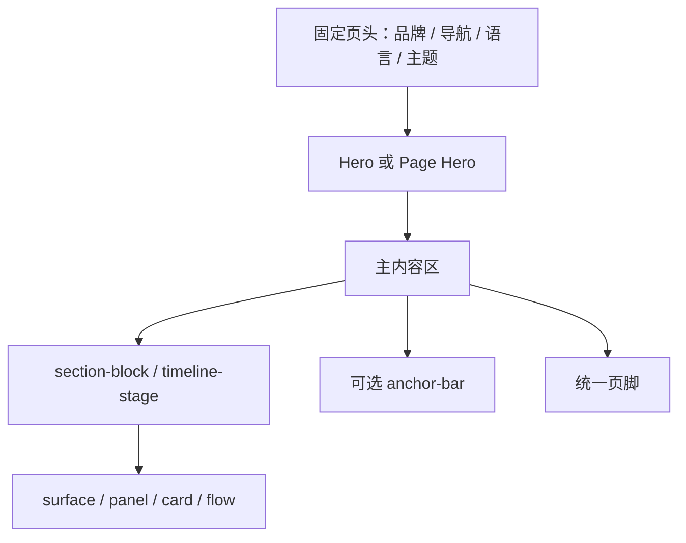

# 设计规范

本文是网站视觉、组件、响应式和内容表达的唯一设计事实源。系统边界见[架构文档](architecture.md)，验证方法见[测试规范](testing.md)，当前实现例外见[维护记录](maintenance.md)。

## 1. 设计原则

1. **内容优先**：层级、留白和排版服务于阅读，不用装饰掩盖信息结构。
2. **共享优先**：同类页面复用 `site.css` 与现有组件，不为单页复制一套视觉语言。
3. **渐进增强**：主题、抽屉、Lightbox 和动画失效时，正文、链接和图片仍可访问。
4. **双语同等**：中英文保持相同的信息能力和操作入口，但不要求逐节点 DOM 镜像。
5. **公开克制**：内容准确、可核查；未获授权的个人材料和未发表研究材料不进入站点。
6. **当前事实优先**：设计愿景不能被写成已经实现的合同；偏差统一记录在维护文档。

## 2. 视觉令牌

所有颜色、尺寸、圆角、字体和间距优先使用 `:root` 自定义属性。新增组件不得复制硬编码主题色形成第三套令牌。

### 2.1 核心令牌

| 类别 | 令牌 | 当前值或语义 |
| --- | --- | --- |
| 主色 | `--primary` | 浅色 `#0066cc`；深色 `#2997ff` |
| 强调色 | `--accent` | 浅色 `#0f766e`；深色 `#38b2ac` |
| 页面背景 | `--bg` | 浅色 parchment；深色黑色 |
| 卡片表面 | `--surface` / `--surface-soft` | 主表面与次级表面 |
| 正文 | `--text` | 随主题切换的高对比正文色 |
| 次级文字 | `--muted` / `--ink-muted-*` | 说明、标签和弱化信息 |
| 边界 | `--hairline` / `--border` | 分隔线和组件边框 |
| 圆角 | `--radius-xs` 至 `--radius-lg` | 当前主要为 5px 或 8px |
| 胶囊 | `--radius-pill` | `9999px` |
| 站点宽度 | `--max-width` | `1440px` |
| 正文宽度 | `--text-width` | `980px` |
| 页头高度 | `--header-h` | `44px` |
| 区块间距 | `--section-space` | 默认 `80px`，随断点缩小 |

深色主题由 `:root[data-theme="dark"]` 覆盖语义令牌。组件应引用语义变量，不直接根据主题选择器重写全部颜色；只有确实需要不同材质或对比度时才增加局部覆盖。

### 2.2 字体

- 拉丁正文优先使用系统 `SF Pro Text`，其次为本地 Inter 和系统无衬线字体。
- 展示标题使用 `--font-display`。
- 中文使用苹方、微软雅黑、Noto CJK 等系统回退链。
- 代码和路径使用 `--font-mono`。
- Inter 字体文件保存在本地，核心排版不依赖外部字体 CDN。

## 3. 页面构图

### 3.1 页头与导航

- `.header-shell` 组织品牌、桌面导航和操作区。
- `.brand-mark` 是 16×16 的 PNG CSS 背景图 `assets/icons/brand-mark.png`，不是 Font Awesome 字形。
- 当前页面用 `aria-current="page"` 标识；404 没有当前导航项。
- 语言切换保持中文、英文对应页可达。
- 主题按钮和菜单按钮必须有可理解的可访问名称。

### 3.2 Hero

- 首页使用双栏 `.hero`：主要叙述与概要卡片并列。
- 内页使用 `.page-hero` 及页面特定修饰类。
- Hero 只承载一句清晰定位、简短说明和主要行动，不堆叠完整正文。
- 宽屏可以并列，窄屏按自然阅读顺序变为单列或紧凑网格。

### 3.3 表面与卡片

| 组件 | 用途 |
| --- | --- |
| `.surface` | 主要内容容器，强调完整区块 |
| `.panel` | 次级独立信息块 |
| `.info-card` / `.project-card` | 条目化信息与项目摘要 |
| `.metric` / `.stat-card` | 数值和统计状态 |
| `.meta-card` | 简短元信息列表 |
| `.flow-step` | 有顺序的方法或过程节点 |
| `.stage-card` | 档案时间线阶段 |

同一层级的组件保持一致内边距、边界和标题层级。不要仅靠颜色区分状态；重要状态同时使用文字、图标或 `data-state`。

### 3.4 网格与流程

- `.grid-2`、`.grid-3`、`.grid-4` 表达同层并列内容。
- `.flow` 表达顺序关系，不用于无顺序卡片。
- `.resume-layout` 在宽屏使用侧栏与主体，窄屏回落为单列。
- `.doc-grid` 内的 `.doc-card` 必须允许收缩；卡片中的证明图横向滑轨只能在自身内部滚动，不能用最小内容宽度撑大页面。
- 卡片数量不足时不补空卡；布局应允许最后一行自然结束。

### 3.5 锚点导航

`.anchor-bar` 用于长页面的章节跳转，并考虑固定页头的滚动偏移。锚点名称应稳定、简短、区分大小写；改名时同步中英文链接和所有入站引用。

### 3.6 证明图与 Lightbox

- `.proof-grid` 展示缩略图，链接指向可查看的原图。
- 图片必须提供准确 `alt`、固有 `width` 和 `height`。
- `data-caption`、可见标题和图片含义保持一致。
- Lightbox 是增强层；无 JavaScript 时普通链接仍可打开图片。
- 中英文证明图以语义和资源库存一致为目标，不通过复制无关个人文字追求 DOM 完全相同。

### 3.7 统计组件

- `.stat-card`、`.metric` 和状态说明使用明确标签，不只显示裸数字。
- 公开 provider 节点与面向用户的展示节点职责分离。
- 统计脚本仅服务中英文首页与统计页；其他页面不放置伪统计占位。
- 第三方失败时显示稳定占位或状态说明，不隐藏主体内容。

## 4. 交互状态

### 4.1 主题

主题状态写入 `data-theme`，键为 `ysb-theme`。切换时同时更新按钮状态、浏览器 `theme-color` 和需要变化的可访问文本。首次访问按已保存值优先，否则跟随系统偏好。

### 4.2 移动抽屉

- 关闭时使用 `inert` 等机制退出交互顺序。
- 打开时将焦点移入抽屉并启用焦点陷阱。
- Escape、遮罩和导航点击都能关闭。
- 关闭后焦点回到菜单按钮。
- `(max-width: 833px)` 移动谓词从匹配变为不匹配时清理遗留状态；焦点若仍在抽屉内，则转移到可见的当前桌面导航项，没有当前项时使用首个桌面导航链接。

### 4.3 Lightbox

打开时保存触发元素、阻止背景误操作；支持 Escape 关闭和必要的键盘导航。关闭后恢复焦点。覆盖层按钮至少提供 44×44px 的稳定点击目标。

### 4.4 动画

动画只用于提示层级和状态，不承担内容传达。使用 `prefers-reduced-motion` 时应降低或取消非必要动画；不可因渐入脚本失败而让正文保持隐藏。

## 5. 响应式合同

实际媒体查询分散在样式表中；下表描述行为边界，不要求源码按表格顺序排列。

| 范围 | 当前设计行为 |
| --- | --- |
| `>= 1069px` | Hero 双栏，使用最大站点宽度和宽屏侧边留白 |
| `1069–1320px` | 仍为双栏，但 Hero 字号、卡片与间距更紧凑 |
| `<= 1068px` | Hero 转单列，四列/三列网格逐步收缩 |
| `<= 833px` | 桌面导航隐藏，移动菜单启用；多数组件改为两列或堆叠 |
| `<= 640px` | 字号、区块留白和页面左右内边距进一步缩小 |
| `<= 419px` | 为极窄屏调整控件、网格和文字换行 |

移动导航的唯一判定谓词是 `(max-width: 833px)`；查询为 false 即进入桌面状态，因此页面缩放产生的 `833px < width < 834px` 小数 CSS 视口也必须清理抽屉。整数边界仍同时检查 833px 和 834px，不能把 834px 写成移动导航状态。响应式调整应覆盖中英文长文本、键盘焦点、横向滚动和触屏点击目标。

简历页在 `<= 640px` 使用单列材料网格，文档卡片保持 `min-width: 0`，成绩单证明图继续在 `.proof-grid` 内横向滚动；侧栏联系方式的值允许在任意位置换行，主体中的长小按钮不得超过父容器并允许正常换行。三项收缩保护在全部视口生效，不放进条件规则重复定义。

## 6. 内容设计

### 6.1 标题层级

- 每页只有一个描述页面主题的 `h1`。
- `h2` 划分主要章节，`h3` 只在所属章节内使用。
- 视觉字号不能替代语义层级。
- kicker 是辅助标签，不承担标题唯一含义。

### 6.2 文案

- 先写可核查事实，再写解释；避免把计划、推测或未发生结果写成事实。
- 按钮使用动作词，如“查看项目”“打开简历”，避免“点击这里”。
- 链接文本说明目标；外部链接和下载材料不要伪装为站内导航。
- 状态文案区分当前状态、历史结果和后续计划。
- 项目文档不复制个人传记；个人页面的内容变化需要明确授权。

### 6.3 双语

- 中英文页面保持相同页面目的、主要入口、资源和 SEO 映射。
- 翻译以自然表达和语义一致为准，不追求字对字或 DOM 对 DOM。
- 页面标题、描述、按钮、图片说明和语言切换目标一起核对。
- 当前档案页结构差异属于已记录例外，见[维护记录](maintenance.md)。

### 6.4 404 原地本地化

根 404 使用单一活动页面结构，不能复制两套带重复抽屉 ID、计时器和交互控件的完整 DOM。双语值通过成对的 `data-not-found-zh-*` / `data-not-found-en-*` 属性挂在现有节点上；`site.js` 必须在主题和抽屉初始化前同步可见文案、链接、head 元数据、manifest、主题标签和 ARIA 名称。根页本地路径一律从 `/` 开始，确保任意深度的缺失 URL 不会把 CSS、脚本或导航解析到错误目录。英文可见值沿用物理 `en/404.html`，普通导航不标当前项。

## 7. 资源与图标

- 品牌图、favicon、字体和核心图片使用本地资源。
- Font Awesome 仅用于功能图标；图标旁保留可见文字或可访问名称。
- 资源路径必须使用与磁盘一致的大小写。
- 图片替换优先保持路径稳定；需要改名时同步 HTML、CSS、文档和验证器覆盖。
- 公开下载材料只保留已明确授权的简历与成绩单类别；不得提交未发表研究材料。

## 8. 可访问性

- 保留跳到主内容链接和唯一 `main`。
- 键盘可到达导航、主题、抽屉、Lightbox、主要按钮和普通链接。
- 焦点样式清晰，不用 `outline: none` 消除反馈。
- 文字与背景保持可读对比；弱化文字仍须可辨识。
- 图片使用真实替代文本；纯装饰图才使用空 `alt`。
- 新窗口链接带 `noopener noreferrer`。
- 状态变化需要文本或适当 ARIA，不只依靠颜色和动画。

## 9. 样式维护规则

1. 优先复用令牌和现有组件，再新增选择器。
2. 新样式写入 `site.css`；不要新增内联样式。当前个人页的既有例外不在文档重构中修改。
3. 新交互进入 `site.js`；页面不新增可执行内联脚本，结构化数据等惰性数据块按各自合同维护。
4. 修改断点前搜索全部同值媒体查询，按最终级联验证。
5. 不用正则批量重写嵌套 HTML；采用结构化、可审查的小范围编辑。
6. 设计变更完成后按[测试规范](testing.md)检查双主题、边界宽度、键盘和双语页面。

## 10. 术语

| 术语 | 本项目含义 |
| --- | --- |
| 可索引页面 | 具有 canonical/hreflang 等普通 SEO 合同并进入 sitemap 的 12 个页面 |
| 404 例外 | `noindex`、无 canonical/hreflang/JSON-LD 且不进 sitemap 的两页 |
| Surface | 承载主要内容的通用表面容器 |
| Panel | 比 Surface 更轻量的独立信息块 |
| Page Hero | 内页顶部的标题、说明和主要操作区 |
| Anchor Bar | 长页面的章节锚点导航 |
| Proof Grid | 证明图缩略图与原图入口网格 |
| Brand Mark | `assets/icons/brand-mark.png` 提供的 16×16 品牌图 |
| Stats-enabled | 实际加载 `assets/js/stats.js` 的四个页面 |
| Provider 节点 | 第三方统计脚本写入的隐藏 DOM，不直接承担展示 |
| `ysb-theme` | 浏览器中持久化主题选择的 localStorage 键 |
| 语义一致 | 双语页面目的、事实和操作等价，不等于 DOM 完全相同 |
