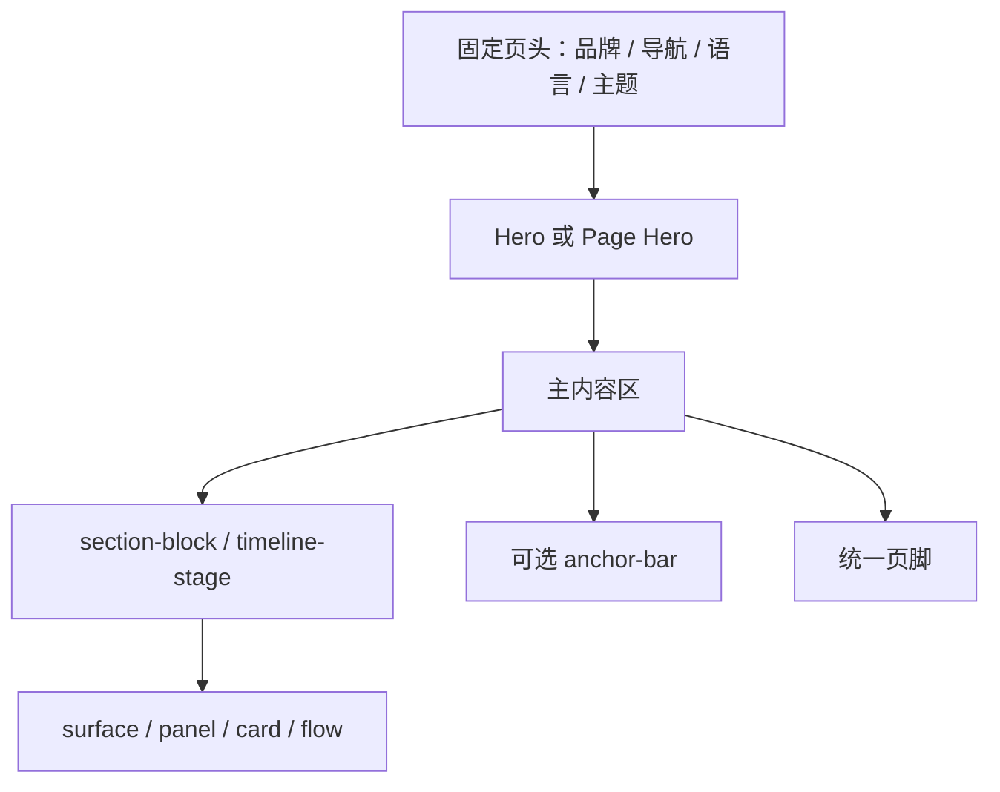

# 设计规范

本文是网站视觉、组件、响应式和内容表达的唯一设计事实源。系统边界见[架构文档](architecture.md)，验证方法见[测试规范](testing.md)，当前实现例外见[维护记录](maintenance.md)。

## 1. 设计原则

1. **内容优先**：层级、留白和排版服务于阅读，不用装饰掩盖信息结构。
2. **共享优先**：同类页面复用 `site.css` 与现有组件，不为单页复制一套视觉语言。
3. **渐进增强**：主题、抽屉、Lightbox 和动画失效时，正文、链接和图片仍可访问。
4. **双语同等**：中英文保持相同的信息能力和操作入口，但不要求逐节点 DOM 镜像。
5. **公开克制**：内容准确、可核查；未获授权的个人材料和未发表研究材料不进入站点。
6. **当前事实优先**：设计愿景不能被写成已经实现的合同；偏差统一记录在维护文档。
7. **克制统一**：以中性表面、排版和细分隔建立研究档案感；深色只作为章节级锚点，不连续堆叠大面积深色区，也不依赖渐变、重阴影或装饰性卡片制造层级。

## 2. 视觉令牌

所有颜色、尺寸、圆角、字体和间距优先使用 `:root` 自定义属性。新增组件不得复制硬编码主题色形成第三套令牌。

### 2.1 核心令牌

| 类别 | 令牌 | 当前值或语义 |
| --- | --- | --- |
| 主色 | `--primary` | 浅色 `#0066cc`；深色 `#2997ff` |
| 强调色 | `--accent` | 浅色 `#0f766e`；深色 `#38b2ac` |
| 页面背景 | `--bg` | 浅色 parchment；深色黑色 |
| 卡片表面 | `--surface` / `--surface-soft` | 主表面与次级表面 |
| 正文 | `--text` | 随主题切换的高对比正文色 |
| 次级文字 | `--muted` / `--ink-muted-*` | 说明、标签和弱化信息 |
| 边界 | `--hairline` / `--border` | 分隔线和组件边框 |
| 圆角 | `--radius-xs` 至 `--radius-lg` | 当前主要为 5px 或 8px |
| 胶囊 | `--radius-pill` | `9999px` |
| 站点宽度 | `--max-width` | `1440px` |
| 正文宽度 | `--text-width` | `980px` |
| 页头高度 | `--header-h` | `44px` |
| 区块间距 | `--section-space` | 默认 `80px`，随断点缩小 |

深色主题由 `:root[data-theme="dark"]` 覆盖语义令牌。组件应引用语义变量，不直接根据主题选择器重写全部颜色；只有确实需要不同材质或对比度时才增加局部覆盖。

### 2.2 字体

- 拉丁正文优先使用系统 `SF Pro Text`，其次为本地 Inter 和系统无衬线字体。
- 展示标题使用 `--font-display`。
- 中文使用苹方、微软雅黑、Noto CJK 等系统回退链。
- 代码和路径使用 `--font-mono`。
- Inter 字体文件保存在本地，核心排版不依赖外部字体 CDN。

## 3. 页面构图

### 3.1 页头与导航

- `.header-shell` 组织品牌、桌面导航和操作区。
- `.brand-mark` 以 16×16 显示 64×64 的 PNG CSS 背景图 `assets/icons/brand-mark.png`，为高像素密度屏幕保留四倍采样；它不是 Font Awesome 字形。
- 当前页面用 `aria-current="page"` 标识；404 没有当前导航项。
- 语言切换保持中文、英文对应页可达。
- 主题按钮和菜单按钮必须有可理解的可访问名称。

### 3.2 Hero

- 首页使用双栏 `.hero`：主要叙述与概要卡片并列。
- 内页使用 `.page-hero` 及页面特定修饰类。
- Hero 只承载一句清晰定位、简短说明和主要行动，不堆叠完整正文。
- 首页 Hero 的两栏共用一张连续的基础画布与 `44px` 低密度网格，不为左右栏分别铺设白灰底板；研究标签保持内容宽度。右栏外层使用 `.hero-side-surface` 作为背景语义钩子，布局与背景不得依赖它在 Hero 中的子元素序号。灰色章节从后续“当前在做”开始，避免宽屏出现全高竖向色块、单列状态出现与后续章节粘连的长灰带。
- 内页 Hero 不设置视口比例最小高度，由标题、说明、操作和响应式内边距共同决定自然高度；不得用固定高度、额外高度下限或 `max-height` 人为补空白或裁切长英文和窄屏内容。
- 宽屏可以并列，窄屏按自然阅读顺序变为单列或紧凑网格。
- 首页在 `<= 640px` 把 `.hero-side-surface` 内的 `.hero-side` 保留为居中吸附的“档案式”横向滑轨，而不是改成纵向堆叠。滑轨的布局、横向滚动、吸附、内边距和滚动条隐藏由最终移动端组件规则完整声明，不依赖前置媒体块补齐。现有四张直属卡片统一使用 `calc(100% - 56px)` 宽度、`216px` 最低高度、`28px` 两端留白和 `12px` 间距；正常文案下保持同高，浏览器放大、长英文或状态文案增长时由内容自然撑开，并以滑轨交叉轴拉伸保持动态等高，不设置固定高度上限。首卡居中时稳定露出下一卡 `16px`，卡片之间继续按中心吸附。右侧区块的背景网格放宽到 `48px`，避免窄屏出现过密纹理。
- 首页右栏固定为四张直属卡片：身份信息、当前研究叙述、工具维护叙述与快捷入口。身份卡把地点和邮箱显示为无次级外框的信息行；两张叙述卡只使用标题和自然段，不恢复关键词胶囊矩阵；唯一的 `.home-quick-card` 直接包含唯一的 `.home-quick-links`，其研究、项目、个人档案与 GitHub 四个入口使用 2×2 网格，并在移动端保持至少 `44px` 触控高度。近期状态在桌面使用标签与正文并列的紧凑行，在 `<= 640px` 改为标签在上、正文在下，避免长论文题目和状态说明被压入过窄的正文列。中英文标题、正文、联系方式与入口文字都必须在卡片内换行，不得撑出卡片或页面。首页不放访问统计卡、统计 DOM 或统计脚本。
- 首页引文区沿用 `.section-block` 的响应式上下内边距并由内容决定高度，不设置视口比例最小高度，避免一句引文取得与研究、项目概览相同的章节权重。
- 首页引文主文使用 `--on-dark`，署名使用 `--body-muted`；通用深色段落规则不得把两者压成同一弱化色。

### 3.3 表面与卡片

| 组件 | 用途 |
| --- | --- |
| `.surface` | 主要内容容器，强调完整区块 |
| `.panel` | 次级独立信息块 |
| `.info-card` / `.project-card` | 条目化信息与项目摘要 |
| `.metric` / `.stat-card` | 数值和统计状态 |
| `.meta-card` | 简短元信息列表 |
| `.flow-step` | 有顺序的方法或过程节点 |
| `.stage-card` | 档案时间线阶段 |

同一层级的组件保持一致内边距、边界和标题层级。不要仅靠颜色区分状态；重要状态同时使用文字、图标或 `data-state`。

章节底色与卡片材质承担不同层级，而且必须由内容职责显式指定，不得通过 `:nth-of-type` 等 DOM 奇偶规则推导。普通 `.section-block` 使用基础画布；`.section-muted` 只标记用于分组、补充或证明材料的中性章节；`.tile-dark` 保留给极少数真正承担收尾或强调职责的章节，当前正文中仅首页引文使用。普通内页统一从浅灰 `.page-hero` 进入白色主章节，再按内容关系显式穿插浅灰辅助章节；研究页不再在正文中插入深色块。首页按职责形成“白色 Hero、浅灰当前研究、白色近期状态、浅灰研究之外、深色引文”的节奏，不在 Hero 内部提前切出灰色半幅。深色主题沿用相同语义，以黑色、弱化深灰和强调深灰区分层级。只有可独立扫描、比较或操作的信息才使用卡片，简单正文不额外套框，也不连续嵌套同材质卡片。

档案与简历采用“外层归档容器、内层编辑分隔”的层级：档案概览使用上下发丝线与列间分隔，时间线保留 `.stage-card` 外框；简历保留 `.resume-sidebar` 和 `.resume-main` 外框。上述容器内部的阶段详情、故事、侧栏元信息及教育/项目条目使用透明底和顶部细分隔，不再重复形成完整卡框；头像、证明材料、按钮与标签仍保持各自边界和交互职责。

### 3.4 网格与流程

- `.grid-2`、`.grid-3`、`.grid-4` 表达数量相对稳定的同层并列内容。
- `.project-grid` 使用带最小卡片宽度的 `auto-fit` 网格表达可持续增长的项目目录：单项铺满整行，两项在可容纳时等宽铺满；三项以上建立多列后，后续不满行继续沿用既有轨道宽度，不因剩余数量突然放大。`.project-grid--featured` 提高证明型项目的最小宽度。
- `.flow` 表达顺序关系，不用于无顺序卡片。
- `.resume-layout` 在宽屏使用侧栏与主体，窄屏回落为单列。
- 研究页与项目页继续复用全站 `.page-hero`、`.section-block`、`.panel` 和响应式网格，不创建独立的页面级视觉子系统。
- 研究方向是并列主题，不使用流程编号；项目按稳定类别组织，项目数量与仓库、图片、论文等可选入口不得写死在布局中。
- `.info-grid` 保留多栏流供三项以上的阶段信息自然平衡；单卡自动铺满，恰有两卡且包含长列表时改为纵向卡片，并让长列表在足够宽时于卡片内部自适应分栏。不得用等高拉伸制造更大的空卡。
- `.doc-grid` 内的 `.doc-card` 必须允许收缩；卡片中的证明图横向滑轨只能在自身内部滚动，不能用最小内容宽度撑大页面。
- 简历材料区使用静态缩略图和独立 PDF 入口，不再重复嵌入整页 PDF 插件视图；竖版简历缩略图以 `object-fit: contain` 完整显示，不以裁切正文换取满框效果。
- 简历侧栏的关键词标签在窄列中允许按词换行，不能以单行文本溢出并覆盖相邻标签。
- 卡片数量不足时不补空卡；布局应允许最后一行自然结束。

### 3.5 锚点导航

`.anchor-bar` 用于长页面的章节跳转，并考虑固定页头的滚动偏移。锚点名称应稳定、简短、区分大小写；改名时同步中英文链接和所有入站引用。

### 3.6 证明图与 Lightbox

- `.proof-grid` 展示缩略图，链接指向可查看的原图。
- 普通、宽版和紧凑证明滑轨使用同一张卡片规格：宽度为 `min(78vw, 280px)`、高度为 `366px`；图片固定为 4:3，说明区占用剩余高度，因此同一滑轨中的卡片外框保持一致。
- 原生横向滚动条保留为回退入口；支持 Pointer Events 的桌面浏览器显示 `grab` / `grabbing` 光标，并在鼠标主键移动至少 6px 后拖动滑轨。拖动后的合成点击会被隔离，普通点击和键盘激活仍打开 Lightbox；触屏继续使用浏览器原生横向手势。
- 图片必须提供准确 `alt`、固有 `width` 和 `height`。
- `data-caption`、可见标题和图片含义保持一致。
- Lightbox 是增强层；无 JavaScript 时普通链接仍可打开图片。
- 中英文证明图以语义和资源库存一致为目标，不通过复制无关个人文字追求 DOM 完全相同。

### 3.7 统计组件

- `.stat-card`、`.metric` 和状态说明使用明确标签，不只显示裸数字。
- 统计页的三项公开数值使用 `.stats-grid--balanced` 自适应换行；三项当前浏览器数值与两项日期记录分组显示，让末行按真实项目数填满，不补空卡，也不把日期强行套入大数字卡的固定高度。
- 位置图标只用于三项公开指标；当前浏览器记录使用文字标签，避免把公开指标的眼睛、用户和页面图标机械复用到不同语义。
- 统计口径与隐私说明限制在正文阅读宽度内，长句不得横跨整个桌面容器。
- 公开指标固定为站点访问、当前页面访问和“本月独立设备（估算）”；中英文都要明确它从 `2026-07-22` 开始统计。
- 统计脚本仅服务中英文统计页；首页和其他页面不放置伪统计占位、endpoint 或统计依赖。
- Worker 请求失败、超时或返回无效字段时，三项公开值统一显示 `--`，不隐藏主体或本地访问记录。
- `#stats-status` 使用单一礼貌播报区承载 `loading`、`ok` 与 `warn`，状态含义由文字和 `data-state` 共同表达；不展示部分成功状态。

## 4. 交互状态

### 4.1 主题

主题状态写入 `data-theme`，键为 `ysb-theme`。切换时同时更新按钮状态、浏览器 `theme-color` 和需要变化的可访问文本。首次访问按已保存值优先，否则跟随系统偏好。

### 4.2 移动抽屉

- 关闭时使用 `inert` 等机制退出交互顺序。
- 打开时将焦点移入抽屉并启用焦点陷阱。
- Escape、遮罩和导航点击都能关闭。
- 关闭后焦点回到菜单按钮。
- `(max-width: 833px)` 移动谓词从匹配变为不匹配时清理遗留状态；焦点若仍在抽屉内，则转移到可见的当前桌面导航项，没有当前项时使用首个桌面导航链接。

### 4.3 Lightbox

打开时保存触发元素、阻止背景误操作；支持 Escape 关闭和必要的键盘导航。关闭后恢复焦点。覆盖层按钮至少提供 44×44px 的稳定点击目标。

### 4.4 动画

动画只用于提示层级和状态，不承担内容传达。使用 `prefers-reduced-motion` 时应降低或取消非必要动画；不可因渐入脚本失败而让正文保持隐藏。

## 5. 响应式合同

实际媒体查询分散在样式表中；下表描述行为边界，不要求源码按表格顺序排列。

| 范围 | 当前设计行为 |
| --- | --- |
| `>= 1069px` | Hero 双栏，使用最大站点宽度和宽屏侧边留白 |
| `1069–1320px` | 仍为双栏，但 Hero 字号、卡片与间距更紧凑 |
| `<= 1068px` | Hero 转单列，四列/三列网格逐步收缩 |
| `<= 833px` | 桌面导航隐藏，移动菜单启用；品牌、语言、图标按钮及小按钮提供至少 `44px` 触控高度；多数组件改为两列或堆叠 |
| `<= 640px` | 字号、区块留白和页面左右内边距进一步缩小 |
| `<= 419px` | 为极窄屏调整控件、网格和文字换行 |

移动导航的唯一判定谓词是 `(max-width: 833px)`；查询为 false 即进入桌面状态，因此页面缩放产生的 `833px < width < 834px` 小数 CSS 视口也必须清理抽屉。整数边界仍同时检查 833px 和 834px，不能把 834px 写成移动导航状态。该移动谓词内，品牌链接、语言链接、页头和抽屉图标按钮、返回顶部按钮及小按钮的稳定触控目标不得小于 `44px`；两列 `.grid-3` 中的长小按钮还必须限制在卡片内并允许换行。响应式调整同时覆盖中英文长文本、键盘焦点和横向滚动。

首页长主标题在 `>= 641px` 使用 `clamp(40px, 3.75vw, 56px)` 连续缩放，避免单栏与双栏切换时因长英文出现突兀的高度跳变；`<= 640px` 继续服从通用 Hero 窄屏字号。

首页移动 Hero 的卡片规格、内部组合与横向吸附以[首页 Hero 设计合同](#32-hero)为准；`<= 640px` 的通用缩进不得覆盖这套滑轨留白，也不得重新引入固定高度上限或同一滑轨内的不同卡高。

简历页在 `<= 640px` 使用单列材料网格，文档卡片保持 `min-width: 0`，成绩单证明图继续在 `.proof-grid` 内横向滚动；侧栏联系方式的值允许在任意位置换行，主体中的长小按钮不得超过父容器并允许正常换行。三项收缩保护在全部视口生效，不放进条件规则重复定义。

档案概览的邮箱标签与阶段摘要标签在全部视口允许收缩和任意位置换行；长英文邮箱或研究方向不得扩大页面宽度。阶段信息按卡片数量和长列表结构响应：单卡占满，极不对称的两卡纵向排列，长列表只在自身卡片内分栏。证明图横向位移只能发生在各自 `.proof-grid` 内。

研究页的背景、意义和方向卡片使用 `.grid-2`、`.grid-3`、`.grid-4`；项目目录按类别使用 `.project-grid`，条目增加时无需修改固定列数，并在窄屏自然回落为单列。带获奖或证明材料的工程项目使用独立置顶组，避免与无媒体短卡共享同一行；普通项目达到多列后，末行保留前一行的轨道宽度，不以拉伸卡片填补空位，卡片内操作入口在同一行底部对齐。项目标题、技术标签和按钮必须允许在窄屏收缩或换行；证明图仍通过现有 Lightbox 查看原图。

## 6. 内容设计

### 6.1 标题层级

- 每页只有一个描述页面主题的 `h1`。
- `h2` 划分主要章节，`h3` 只在所属章节内使用。
- 首页“当前在做”“近期状态”“研究之外”分别使用可见且唯一的 `h2#home-current-title`、`h2#home-updates-title` 与 `h2#home-beyond-title`，各自所在 `section` 通过 `aria-labelledby` 精确引用。
- 视觉字号不能替代语义层级。
- kicker 是辅助标签，不承担标题唯一含义。

### 6.2 文案

- 先写可核查事实，再写解释；避免把计划、推测或未发生结果写成事实。
- 按钮使用动作词，如“查看项目”“打开简历”，避免“点击这里”。
- 链接文本说明目标；外部链接和下载材料不要伪装为站内导航。
- 状态文案区分当前状态、历史结果和后续计划。
- 项目文档不复制个人传记；个人页面的内容变化需要明确授权。
- 研究页以背景、问题意义和稳定的大方向为主；未正式公开的论文方法、贡献、实验设置和结果不进入页面。
- 项目页是可持续扩展的目录。卡片统一声明问题、本人工作与公开边界，仓库、演示、论文和证明材料均为可选入口；普通收藏式 fork 不作为个人项目展示。

### 6.3 双语

- 中英文页面保持相同页面目的、主要入口、资源和 SEO 映射。
- 翻译以自然表达和语义一致为准，不追求字对字或 DOM 对 DOM。
- 页面标题、描述、按钮、图片说明和语言切换目标一起核对。
- 当前档案页结构差异属于已记录例外，见[维护记录](maintenance.md)。

英文正文采用自然、克制的美式学术英语。下表是跨页术语的唯一事实源；验证器只锁定高置信度的陈旧表达，不用自动规则替代人工语义复核。

| 中文概念 | 统一英文 | 避免使用 |
| --- | --- | --- |
| 河北冀州中学 | `Hebei Jizhou High School` | 非官方中文校名对应的旧译 |
| 本科毕业设计 | `undergraduate capstone project` | `graduation design` |
| 多端 / 多终端 | `multi-platform` | `multi-terminal` |
| 实训 | `industry training` | 把实训一律写成 `internship` |
| 前后端分离 | `decoupled front-end/back-end architecture` | `front-end / back-end separated` |
| 阶段性报告 | `periodic reports` | `staged reports` |
| 概率下界 | `probability lower bound` | 省略 `lower` 的 `probability bound` |
| 概率保证 | `probabilistic guarantee` | `probability guarantee` |
| 随机障碍证书 | `stochastic barrier certificate` | 无依据增加 `-like` |
| 随机障碍型证书 | `stochastic barrier-like certificate` | 删除原文中的 `-like` |
| 证明材料 | `supporting documents` / `supporting evidence` | `proof photo` / `project proof` |
| MCM 优秀奖 | `Honorable Mention` | `Honourable Mention` |

论文标题沿用公开标题，状态只写当前可核查值，不新增未发表论文的摘要、方法、结果或评审内容。证书或正式记录中的角色名称保持原样；叙述职责时可以使用自然英语，但不能借润色改变事实。

### 6.4 404 原地本地化

根 404 使用单一活动页面结构，不能复制两套带重复抽屉 ID、计时器和交互控件的完整 DOM。双语值通过成对的 `data-not-found-zh-*` / `data-not-found-en-*` 属性挂在现有节点上；`site.js` 必须在主题和抽屉初始化前同步可见文案、链接、head 元数据、manifest、主题标签和 ARIA 名称。根页本地路径一律从 `/` 开始，确保任意深度的缺失 URL 不会把 CSS、脚本或导航解析到错误目录。英文可见值沿用物理 `en/404.html`，普通导航不标当前项。

## 7. 资源与图标

- 导航品牌图继续使用 64×64 的 `assets/icons/brand-mark.png`；192×192 与 512×512 安装 PNG 是独立发布资产。需要重新生成时从已批准的高分辨率方形母版或 512×512 安装图机械缩放，不反向放大导航小图，也不重新设计。
- 安装 PNG 只承担 manifest 的 `purpose: any` 图标；`assets/icons/site.ico` 只承担 HTML favicon。精确清单与元数据由[架构合同](architecture.md#44-品牌与图标)维护。
- 品牌图、安装图标、favicon、字体和核心图片均使用本地资源。
- Font Awesome 仅用于功能图标；图标旁保留可见文字或可访问名称。
- 资源路径必须使用与磁盘一致的大小写。
- 图片替换优先保持路径稳定；需要改名时同步 HTML、CSS、文档和验证器覆盖。
- 公开下载材料只保留已明确授权的简历与成绩单类别；不得提交未发表研究材料。

## 8. 可访问性

- 保留跳到主内容链接和唯一 `main`。
- 键盘可到达导航、主题、抽屉、Lightbox、主要按钮和普通链接。
- 焦点样式清晰，不用 `outline: none` 消除反馈。
- 文字与背景保持可读对比；弱化文字仍须可辨识。
- 图片使用真实替代文本；纯装饰图才使用空 `alt`。
- 新窗口链接带 `noopener noreferrer`。
- 状态变化需要文本或适当 ARIA，不只依靠颜色和动画。

## 9. 样式维护规则

1. 优先复用令牌和现有组件，再新增选择器。
2. 新样式写入 `site.css`；不要新增内联样式。当前个人页的既有例外不在文档重构中修改。
3. 新交互进入 `site.js`；页面不新增可执行内联脚本，结构化数据等惰性数据块按各自合同维护。
4. 修改断点前搜索全部同值媒体查询，按最终级联验证。
5. 不用正则批量重写嵌套 HTML；采用结构化、可审查的小范围编辑。
6. 设计变更完成后按[测试规范](testing.md)检查双主题、边界宽度、键盘和双语页面。

## 10. 术语

| 术语 | 本项目含义 |
| --- | --- |
| 可索引页面 | 具有 canonical/hreflang 等普通 SEO 合同并进入 sitemap 的 12 个页面 |
| 404 例外 | `noindex`、无 canonical/hreflang/JSON-LD 且不进 sitemap 的两页 |
| Surface | 承载主要内容的通用表面容器 |
| Panel | 比 Surface 更轻量的独立信息块 |
| Page Hero | 内页顶部的标题、说明和主要操作区 |
| Anchor Bar | 长页面的章节锚点导航 |
| Proof Grid | 证明图缩略图与原图入口网格 |
| Brand Mark | 由 64×64 `assets/icons/brand-mark.png` 提供的 16×16 品牌图 |
| Stats-enabled | 实际加载 `assets/js/stats.js` 的中英文统计页 |
| 本月独立设备（估算） | 按上海时区自然月对 Worker 内生成的 IP 与 User-Agent HMAC 摘要去重，不等同于独立访客或真人 |
| `ysb-theme` | 浏览器中持久化主题选择的 localStorage 键 |
| 语义一致 | 双语页面目的、事实和操作等价，不等于 DOM 完全相同 |
