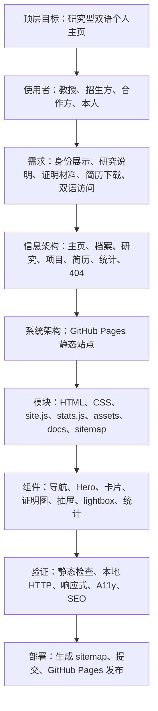
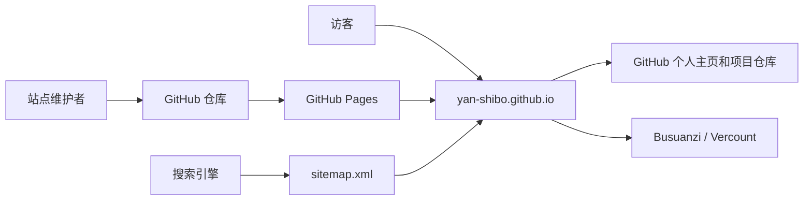
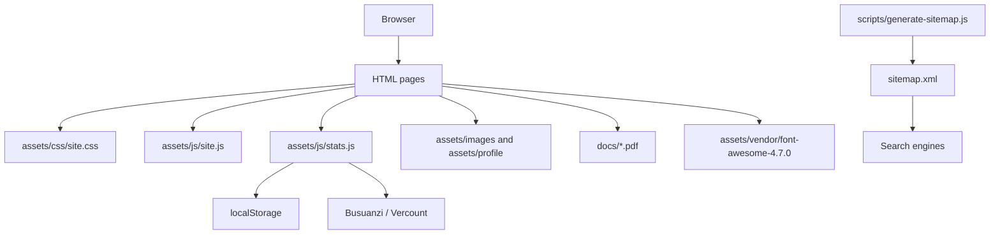
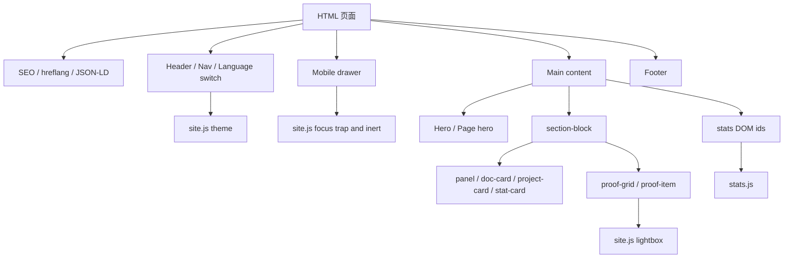
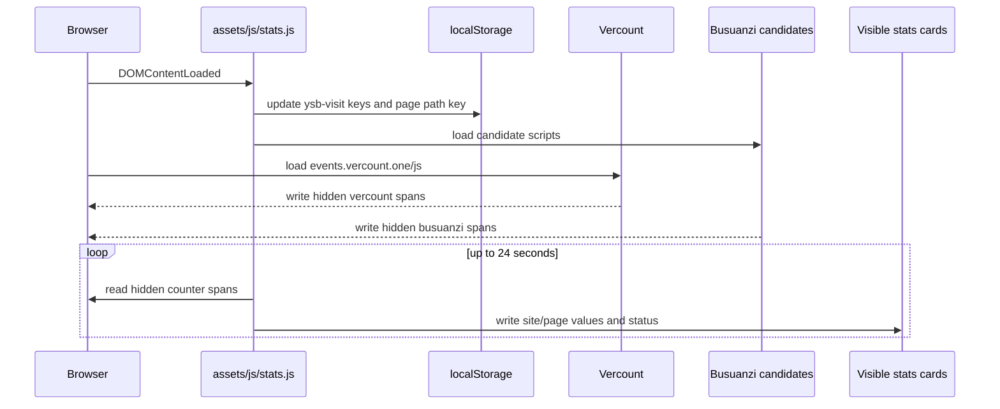
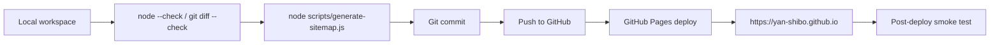

# 闫士博个人主页架构与设计演进

本文记录当前站点从顶层目标到页面、资源、样式、脚本和发布流程的设计逻辑，同时涵盖外部集成与 DOM 契约、数据模型与资源规范、隐私合规说明以及技术决策记录 (ADR)。后续改页面时应先读本文，再读 `docs/design/issues_and_fixes.md` 中的回归问题清单。

## 1. 顶层目标

本站是一个双语研究型个人主页，不是营销落地页。设计目标是让教授、招生或合作方在很短时间内确认三件事：

1. 闫士博是谁，当前研究方向是什么。
2. 研究、项目、奖项和履历是否有真实材料支撑。
3. 简历、成绩单、项目仓库和联系方式是否容易找到。

因此站点采用"研究身份 + 证据材料 + 可下载文件"的信息架构，而不是大面积宣传文案。

## 2. 软件工程设计分层

本站按自顶向下方式设计：先定义目标和约束，再分解功能需求，随后落到信息架构、系统容器、页面组件、数据流、部署和测试。



### 2.1 功能需求

| 编号 | 需求 | 对应实现 |
| --- | --- | --- |
| FR-1 | 中英文双语访问 | 根目录中文页和 `en/` 英文页 |
| FR-2 | 研究身份展示 | 首页 Hero、研究页方法链 |
| FR-3 | 证明材料浏览 | 档案页、项目页、简历页证明图和 lightbox |
| FR-4 | 简历和成绩单下载 | `docs/*.pdf` 和简历页 iframe |
| FR-5 | 访问统计展示 | `analytics.html`、首页统计卡、`stats.js` |
| FR-6 | 移动端导航 | `drawer`、`site.js` 焦点陷阱 |
| FR-7 | 主题切换 | `data-theme`、`ysb-theme`、CSS 主题变量 |

### 2.2 非功能需求

| 编号 | 约束 | 设计响应 |
| --- | --- | --- |
| NFR-1 | 零构建、易部署 | 原生 HTML/CSS/JS，GitHub Pages 直接托管 |
| NFR-2 | 快速加载 | 少量 JS、本地图标字体、静态资源 |
| NFR-3 | SEO 友好 | canonical、`hreflang`、JSON-LD、sitemap |
| NFR-4 | 无障碍 | skip link、`aria-current`、抽屉 `inert`、focus trap |
| NFR-5 | 响应式 | 1068、833、640、419px 断点 |
| NFR-6 | 可维护 | 共享 CSS/JS，文档化问题清单和测试清单 |

## 3. 系统架构

站点是零后端静态站点，由 GitHub Pages 直接托管根目录文件。浏览器只加载 HTML、共享 CSS、共享 JS、本地图标字体、图片/PDF 和第三方访问计数脚本。

### 3.1 上下文图



### 3.2 容器图



没有服务端数据库、登录、表单提交或自有 API。所有状态都在浏览器本地或第三方统计服务中。

### 3.3 前端组件图



## 4. 路由结构

| 中文路由 | 英文路由 | 角色 |
| --- | --- | --- |
| `/` / `index.html` | `/en/` / `/en/index.html` | 首屏身份、研究主线、关键材料入口 |
| `profile.html` | `en/profile.html` | 按时间线组织教育、竞赛、项目、组织经历和证明图片 |
| `research.html` | `en/research.html` | 解释 reach-avoid 控制、SAC、PAC、SBC、SOS/SDP 方法链 |
| `projects.html` | `en/projects.html` | 展示毕业设计和中软实训两个系统项目 |
| `resume.html` | `en/resume.html` | 在线简历、PDF 简历、成绩单和材料预览 |
| `analytics.html` | `en/analytics.html` | 公开访问计数和当前浏览器本地访问记录 |
| `404.html` | `en/404.html` | GitHub Pages 错误页和自动回首页逻辑 |

`scripts/generate-sitemap.js` 维护这些中英文路由的 `hreflang` 配对。新增、删除或改名页面时，必须同步更新脚本和 `sitemap.xml`。

## 5. 从零开始的设计步骤

### 5.1 内容建模

最先确定的是内容资产，而不是视觉样式：

- 个人身份：姓名、学校、研究生阶段、联系方式、GitHub。
- 研究线索：随机系统、reach-avoid、SAC、PAC、SBC、SOS/SDP。
- 证明材料：成绩单、奖项、实训、项目、各阶段证书。
- 项目材料：PersevereStudy 和 MicFamily 两个仓库及对应成果图片。
- 下载材料：PDF 简历、本科成绩单、研究论文。

### 5.2 信息架构

主页只承担"入口"和"判断价值"的作用。更完整的信息拆到独立页面：

- 主页用双栏 Hero 建立第一印象，下面用研究线和材料卡片引导跳转。
- 档案页负责完整证明链，按研究生、本科、高中、初中、小学分段。
- 研究页负责方法链，不混入过多履历材料。
- 项目页只讲系统项目，避免和档案页重复堆奖项。
- 简历页负责快速投递和下载，不替代档案页。
- 统计页把第三方公开统计和本机记录分开，降低数据误解。

### 5.3 视觉架构

视觉采用"研究档案 + 工业级克制"的方向：

- 真实材料优先：照片、证书、成绩单和 PDF 预览是主要视觉资产。
- 颜色克制：白色、纸灰、近黑深色区为主体，蓝色只作为行动色，青色作为研究结构色，暖色只用于梁启超诗句和证据强调。
- 通栏分区：`section-block` 用全宽背景建立节奏，内部内容用 1440px 轨道对齐。
- 卡片有限使用：卡片用于材料、项目、统计、证明图，不把整页包进大卡片。

### 5.4 HTML 结构

每个页面共享同一套结构：

1. `<head>` 中写清 `title`、`description`、canonical、`hreflang`、OG/Twitter 元数据和必要 JSON-LD。
2. `<header class="site-header">` 负责桌面导航、语言切换、主题按钮和移动菜单按钮。
3. `<aside class="drawer">` 是移动端抽屉，关闭时必须 `inert` 和 `aria-hidden="true"`。
4. `<main class="main-shell">` 放页面独有内容。
5. `<footer class="footer-shell">` 放邮箱、GitHub、简历和返回顶部。

中英文页面必须保持结构对称，只允许文案、相对路径和语言属性不同。

### 5.5 CSS 架构

`assets/css/site.css` 是唯一核心样式表。它按以下层次工作：

- `:root` 定义颜色、字体、圆角、宽度、间距等设计代币。
- `:root[data-theme="dark"]` 定义深色主题覆盖。
- 基础元素、导航、抽屉、Hero、卡片、网格、证明图、统计、页脚等组件样式集中维护。
- 响应式断点主要是 `1068px`、`833px`、`640px`、`419px`。
- 宽屏对齐使用 `max(24px, calc((100vw - var(--max-width)) / 2))`。

不要在 HTML 中写临时 `style`，不要为单个文案微调创建全局污染选择器。

### 5.6 JS 架构

`assets/js/site.js` 负责界面交互：

- `data-theme` 主题切换，持久化键为 `ysb-theme`。
- 移动端抽屉打开/关闭、焦点陷阱、背景 `inert`。
- 返回顶部按钮显示状态。
- 页内 anchor 高亮。
- 滚动进入动画。
- 图片 lightbox。
- 年份自动更新。

`assets/js/stats.js` 负责访问统计：

- 动态加载 Busuanzi 候选脚本。
- 读取页面已有 Vercount 节点。
- 将有效公开计数同步到可见卡片。
- 用 `localStorage` 维护当前浏览器本地访问记录。
- 在第三方统计失败时显示降级状态，不阻塞页面。

### 5.7 统计数据流



### 5.8 部署视图



## 6. 资源与文档架构

| 路径 | 用途 |
| --- | --- |
| `assets/css/site.css` | 全站共享样式和响应式布局 |
| `assets/js/site.js` | 主题、抽屉、lightbox、anchor、返回顶部等交互 |
| `assets/js/stats.js` | 访问统计与本地浏览记录 |
| `assets/images/` | 证书、成绩单图片、项目证明、材料预览 |
| `assets/profile/` | 头像照片 |
| `assets/icons/site.ico` | 站点 favicon，自定义终端验证图标 |
| `assets/vendor/font-awesome-4.7.0/` | 本地图标字体，brand-mark 使用 terminal 图标 `\f120` |
| `docs/*.pdf` | 简历、成绩单、研究论文等下载材料 |
| `docs/design/` | 设计、架构、问题和样式规范 |
| `docs/design/ops.md` | 部署与故障排查 |
| `docs/design/testing.md` | 质量验证清单 |

## 7. 需求到验证追踪

| 需求 | 关键文件 | 验证 |
| --- | --- | --- |
| FR-1 双语访问 | `*.html`、`en/*.html`、`sitemap.xml` | 检查中英文切换、`hreflang`、sitemap |
| FR-2 研究身份 | `index.html`、`research.html` | 首页和研究页人工阅读检查 |
| FR-3 证明材料 | `profile.html`、`projects.html`、`resume.html` | lightbox、图片路径、移动端溢出 |
| FR-4 PDF 下载 | `docs/*.pdf`、`resume.html` | 打开 PDF 链接和 iframe |
| FR-5 访问统计 | `analytics.html`、`stats.js` | 统计页状态、本地记录、第三方失败降级 |
| FR-6 移动导航 | `site.js`、header/drawer HTML | 833px 以下菜单、Tab、Escape、焦点恢复 |
| FR-7 主题切换 | `site.js`、`site.css` | 切换、刷新保持、深色对比度 |

---

## 8. 外部集成与 DOM 契约

本站没有自有后端 API。所谓"接口"主要是浏览器端与第三方统计脚本、DOM 节点和 `localStorage` 之间的契约。

### 8.1 第三方公开统计

公开统计在 `index.html`、`en/index.html`、`analytics.html`、`en/analytics.html` 中使用。

#### Vercount

- 页面直接加载：`https://events.vercount.one/js`
- 期望写入的 DOM：
  - `#vercount_value_site_pv`
  - `#vercount_value_site_uv`
  - `#vercount_value_page_pv`

#### Busuanzi

`assets/js/stats.js` 会按顺序动态加载候选脚本：

1. `https://busuanzi.icodeq.com/busuanzi.pure.mini.js`
2. `https://cdn.jsdelivr.net/gh/sukkaw/busuanzi@2.3/bsz.pure.mini.js`
3. `https://cdn.jsdelivr.net/npm/busuanzi@2.3.0`

期望写入的 DOM：

- `#busuanzi_value_site_pv`
- `#busuanzi_value_site_uv`
- `#busuanzi_value_page_pv`

### 8.2 页面 DOM 契约

统计页和首页需要提供隐藏计数容器：

```html
<div aria-hidden="true" class="hidden-counter">
  <span id="busuanzi_value_site_pv">--</span>
  <span id="busuanzi_value_site_uv">--</span>
  <span id="busuanzi_value_page_pv">--</span>
</div>
<div aria-hidden="true" class="hidden-counter">
  <span id="vercount_value_site_pv">--</span>
  <span id="vercount_value_site_uv">--</span>
  <span id="vercount_value_page_pv">--</span>
</div>
```

可见统计容器：

- `#site-pv`
- `#site-uv`
- `#page-pv`
- `#stats-status`

统计页额外需要：

- `#local-total`
- `#local-page`
- `#local-days`
- `#local-first`
- `#local-last`

### 8.3 stats.js 数据流程

1. `DOMContentLoaded` 后先更新本地浏览记录。
2. 将 `#stats-status` 设为加载中。
3. 动态加载 Busuanzi，同时读取页面中 Vercount 可能写入的值。
4. 每 1000ms 同步一次，最多 24 次。
5. 三个公开计数都有效时显示成功。
6. 部分计数有效时显示部分成功。
7. 全部不可用时显示不可用，但本地记录仍正常。

有效值判断会排除空值、`--`、`null`、`undefined`、`NaN` 和 `Loading`。

### 8.4 本地浏览记录

`stats.js` 使用 `localStorage`，键名见下方 §9.3。这些数据只在当前浏览器中存在，不上传到任何自有服务器。

### 8.5 新页面接入统计

如果未来新页面也要显示公开统计：

1. 在页面中加入隐藏计数容器。
2. 加入可见的 `#site-pv`、`#site-uv`、`#page-pv` 和 `#stats-status`。
3. 加载 `assets/js/stats.js`。
4. 确认该页面也加载 `https://events.vercount.one/js`，或接受只走 Busuanzi 候选脚本。
5. 检查中英文页面 id 不重复且各自页面内唯一。

### 8.6 故障预期

第三方统计可能被广告拦截、网络策略或服务波动影响。统计失败不属于站点核心故障，只要页面内容、导航和材料下载正常，就应优雅降级。

---

## 9. 数据模型与资源规范

本站没有传统数据库。数据模型由静态页面、结构化元数据、浏览器本地存储、静态资源和 sitemap 共同组成。

### 9.1 页面实体

每个公开页面是一组中英文镜像实体：

| 页面实体 | 中文文件 | 英文文件 |
| --- | --- | --- |
| Home | `index.html` | `en/index.html` |
| Profile | `profile.html` | `en/profile.html` |
| Research | `research.html` | `en/research.html` |
| Projects | `projects.html` | `en/projects.html` |
| Resume | `resume.html` | `en/resume.html` |
| Analytics | `analytics.html` | `en/analytics.html` |
| Not Found | `404.html` | `en/404.html` |

页面实体必须同步维护导航、语言切换、canonical、`hreflang`、标题、描述和主要内容结构。

### 9.2 JSON-LD 结构化数据

多数页面在 `<head>` 中写 Person 或 ProfilePage JSON-LD。核心字段包括：

- `name`
- `alternateName`
- `url`
- `image`
- `email`
- `alumniOf`
- `homeLocation`

个人基本信息变化时，需要同步更新中文页、英文页、JSON-LD、简历页和 PDF 材料。

### 9.3 浏览器本地状态

#### 主题

- 键名：`ysb-theme`
- 取值：`light` 或 `dark`
- 使用者：`assets/js/site.js`
- CSS 状态：`:root[data-theme="dark"]`

#### 本地访问记录

使用者：`assets/js/stats.js`

| 键名 | 值 |
| --- | --- |
| `ysb-visit-total` | 当前浏览器累计访问次数 |
| `ysb-visit-first` | ISO 格式首次访问时间 |
| `ysb-visit-last` | ISO 格式最近访问时间 |
| `ysb-visit-days` | JSON 数组，最多保留 365 天 |
| `ysb-page:<pathname>` | 当前浏览器对某路径的累计打开次数 |

这些数据只用于当前浏览器展示，不作为真实全站分析口径。

### 9.4 静态资源实体

#### Favicon 与品牌图标

- `assets/icons/site.ico` 是全站 favicon，当前使用自定义终端验证图标，表达形式化验证、控制与计算机科学方向。
- `manifest.webmanifest` 继续引用 `/assets/icons/site.ico`。
- 顶部 `brand-mark` 不在 HTML 中写图标，而由 `assets/css/site.css` 的 `.brand-mark::before` 注入 Font Awesome 4.7 terminal 图标：`content:"\f120"`。
- 研究页、研究关键词等语义图标仍可继续使用烧瓶图标；不要把 brand-mark 和研究语义图标混为一处修改。

#### 图片

目录：`assets/images/`

命名规则：

- 小写英文。
- 使用连字符。
- 不使用空格和中文文件名。
- 证明图保留可识别语义，如 `huawei-cup-2024.png`、`transcript-image-1.jpg`。

HTML 使用规则：

- 写 `alt`。
- 写 `width` 和 `height`。
- 非首屏图加 `loading="lazy"` 和 `decoding="async"`。
- 可放大查看的证明图加 `data-lightbox`。

#### 头像

目录：`assets/profile/photo.jpg`

头像被首页、档案页、简历页、OG 图片和 JSON-LD 引用。替换时保持文件名不变，避免全站改链接。

#### PDF

目录：`docs/`

| 文件 | 用途 |
| --- | --- |
| `Shibo-Yan-Resume.pdf` | 简历下载和 iframe 预览 |
| `Shibo-Yan-Undergraduate-Transcript.pdf` | 本科成绩单下载 |
| `Shibo-Yan-Research-Paper.pdf` | 研究论文或报告材料 |

如果改 PDF 文件名，必须全站搜索旧文件名并同步改中英文页面。

### 9.5 sitemap 数据

`scripts/generate-sitemap.js` 中的 `pagePairs` 是 sitemap 的数据源。脚本用本地文件修改时间生成 `lastmod`。

维护规则：

1. 新增页面先加入 `pagePairs`。
2. 运行 `node scripts/generate-sitemap.js`。
3. 检查 `sitemap.xml` 没有重复 URL。
4. 检查每个 URL 都有 `zh-CN`、`en` 和 `x-default` alternate。

### 9.6 文档实体

Markdown 文档只保留与当前静态站点维护有关的内容。泛化的大型项目模板、数据库模板、微服务模板不应放入本仓库文档体系。

---

## 10. 隐私与合规

本站是 GitHub Pages 静态个人主页，没有登录、注册、评论、表单提交或自有后端数据库。

### 10.1 主动收集

本站不主动收集访客姓名、电话、密码、精确地址或其他表单信息。页面公开展示的邮箱、电话、微信和 GitHub 是站点所有者的联系方式，用于他人主动联系。

如果访客通过邮箱主动来信，邮件内容由邮箱服务商和站点所有者处理，不通过本站代码收集。

### 10.2 浏览器本地存储

本站使用 `localStorage` 保存必要的本地偏好和本机访问记录。

| 键名 | 用途 | 是否上传到自有服务器 |
| --- | --- | --- |
| `ysb-theme` | 保存浅色/深色主题偏好 | 否 |
| `ysb-visit-total` | 当前浏览器累计访问次数 | 否 |
| `ysb-visit-first` | 当前浏览器首次访问时间 | 否 |
| `ysb-visit-last` | 当前浏览器最近访问时间 | 否 |
| `ysb-visit-days` | 当前浏览器活跃日期列表 | 否 |
| `ysb-page:<pathname>` | 当前浏览器对某页面的打开次数 | 否 |

清理浏览器数据、换设备或使用无痕模式会重置这些记录。

### 10.3 第三方公开统计

本站使用 Busuanzi 和 Vercount 展示公开 PV/UV 计数。第三方脚本可能依据请求信息完成计数，具体处理方式由对应服务提供方负责。

本站代码只读取第三方写入页面 DOM 的汇总数字，并将其显示到统计卡片中。本站没有自有服务端日志，也不保存访客个人画像。

### 10.4 GitHub Pages 托管日志

本站托管在 GitHub Pages。GitHub 作为托管平台可能为了安全、反滥用、服务稳定性和审计目的记录标准网络请求日志。站点维护者无法直接访问 GitHub Pages 底层请求日志。

### 10.5 Cookie

当前站点代码不主动设置 Cookie。第三方统计或浏览器扩展是否使用 Cookie，取决于第三方服务和用户浏览器环境。

### 10.6 合规维护要求

如果未来新增表单、评论、邮件订阅、后端 API、Google Analytics、Cloudflare Web Analytics 或其他统计服务，必须先更新本节，并明确：

1. 收集哪些数据。
2. 数据保存在哪里。
3. 是否传输给第三方。
4. 用户如何清除或拒绝。
5. 中英文页面是否需要同步展示隐私说明。

---

## 11. 技术决策记录 (ADR)

### ADR-0001: 使用原生 HTML、CSS 和 JavaScript

- 日期：2026-06-23
- 状态：已接受
- 决策者：闫士博

#### 背景

本站是托管在 GitHub Pages 上的双语研究型个人主页。核心需求是：

1. 克隆后可以直接预览，不需要安装依赖或运行构建。
2. 页面加载快，适合简历、研究和证明材料快速查看。
3. 样式需要细粒度控制，包括 1440px 对齐轨道、深色主题、证据卡片、移动抽屉和证明图 lightbox。
4. 中英文页面是独立静态 HTML，需要任何维护者都能直接读懂。

#### 备选方案

**Tailwind CSS**：优点是开发快、组件组合方便。缺点是需要引入构建链或在 HTML 中写大量工具类。对于当前这种少量页面、强证据材料、无模板系统的静态站点，工具类会降低 HTML 可读性。

**Sass 或其他预处理器**：优点是变量和嵌套更强。缺点是引入编译步骤，与"直接打开和直接部署"的目标冲突。

**原生 CSS + CSS 变量**：优点是无构建、可读、可直接部署，并且现代 CSS 已能满足变量、Grid、Flex、媒体查询和主题覆盖需求。

#### 决策

采用原生 HTML、CSS 和 JavaScript：

- 样式集中在 `assets/css/site.css`。
- 交互集中在 `assets/js/site.js` 和 `assets/js/stats.js`。
- 主题状态使用 `:root[data-theme="dark"]`，本地存储键为 `ysb-theme`。
- 不引入 React、Vue、Tailwind、Sass、Webpack 或 Vite。
- 图标继续使用本地 Font Awesome 4.7。

#### 正面影响

- 零构建，GitHub Pages 可直接托管。
- 页面结构清晰，适合人工和 AI 助手维护。
- 样式规则集中，颜色、间距和断点由 `:root` 代币统一。
- 外部依赖少，站点可离线检查大部分内容。

#### 代价

- 中英文页面需要人工同步。
- 响应式和主题样式需要手工维护。
- 没有组件编译器，重复的 header、drawer、footer 需要谨慎保持一致。
- sitemap 页面列表需要手工维护 `scripts/generate-sitemap.js`。

#### ADR 维护要求

1. 新样式优先复用现有组件类。
2. 不新增内联样式。
3. 修改主题、抽屉、统计 DOM id 或 localStorage 键时，同步更新文档。
4. 修改页面路由时，同步更新导航、语言切换、canonical、`hreflang`、sitemap 脚本和测试清单。

---

## 12. 架构不变量

后续任何修改都不能破坏这些约束：

1. 中英文路由结构一一对应。
2. 共享视觉规则只写在 `site.css`。
3. 主题状态使用 `data-theme` 和 `ysb-theme`。
4. 移动抽屉关闭时必须不可聚焦。
5. 证据图片必须有 `alt`、尺寸和 `loading`/`decoding`。
6. 新增或改名页面必须更新 `scripts/generate-sitemap.js` 并重新生成 `sitemap.xml`。
7. 统计脚本失败不应影响核心内容阅读。
