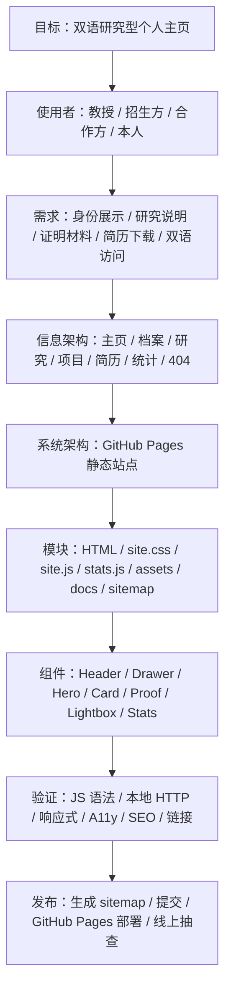
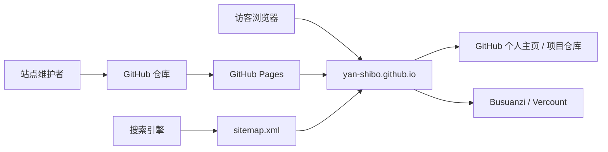
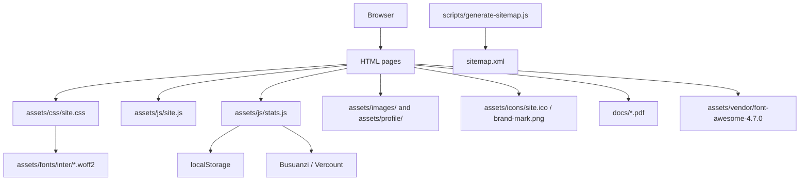
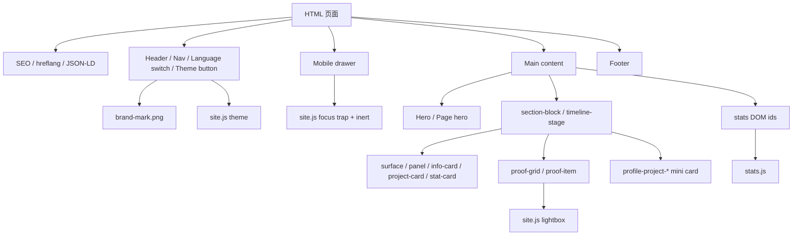
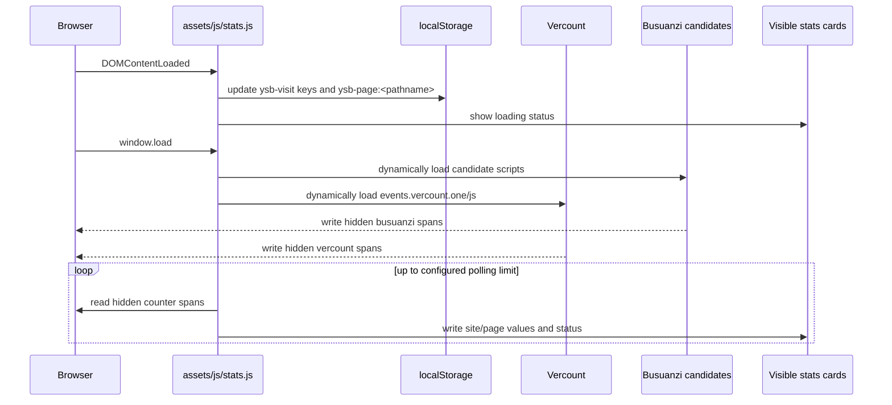

# 闫士博个人主页架构与设计演进

本文面向站点维护者和 AI 编码助手，记录 `Yan-ShiBo.github.io` 当前实现的架构、页面职责、资源组织、DOM 契约、统计流程、隐私边界、测试入口和技术决策。修改页面前先读本文，再读 `docs/design/issues_and_fixes.md`、`docs/design/testing.md` 和 `docs/onboarding.md`。

本文不是通用前端模板。所有约束均围绕当前仓库：双语研究型个人主页、GitHub Pages 静态托管、原生 HTML/CSS/JS、证明材料展示、研究身份说明和简历投递。

## 1. 顶层目标

本站是一个双语研究型个人主页。核心目标是让教授、招生方、合作方或简历评阅者在较短时间内确认以下事实：

1. 闫士博是谁，当前研究方向是什么。
2. 研究、项目、竞赛、奖项和履历是否有材料支撑。
3. 简历、成绩单、证明图、项目仓库和联系方式是否容易找到。
4. 中文访问者和英文访问者能获得结构一致的信息。
5. 站点即使在第三方统计服务失败时，也能正常阅读核心内容。

因此站点采用“研究身份 + 时间线档案 + 方法链说明 + 项目材料 + 可下载文件”的信息架构。页面文案应保持准确、克制、可核查；未发生的投稿计划、未完成的实验结论和无法公开验证的信息不得写得过满。

## 2. 当前项目边界

### 2.1 当前站点形态

| 项目属性 | 当前实现 |
| --- | --- |
| 仓库 | `Yan-ShiBo/Yan-ShiBo.github.io` |
| 线上地址 | `https://yan-shibo.github.io/` |
| 部署方式 | GitHub Pages 静态托管 |
| 构建方式 | 零构建；HTML/CSS/JS 可直接由静态服务器预览 |
| 页面语言 | 根目录中文页面 + `en/` 英文镜像页面 |
| 样式入口 | `assets/css/site.css` |
| 交互入口 | `assets/js/site.js` |
| 统计入口 | `assets/js/stats.js`，仅统计相关页面加载 |
| 字体 | `assets/fonts/inter/*.woff2` 本地 Inter + 系统中文字体栈 |
| 图标 | `assets/icons/site.ico` + `assets/icons/brand-mark.png` + 本地 Font Awesome 4.7 |
| 证明图策略 | 普通证明图 + 研究生阶段 `thumb.webp` / `full.webp` 双文件策略 |
| 数据存储 | 无服务端数据库；仅 `localStorage` 保存主题与本机访问记录 |

### 2.2 不在当前范围内的内容

当前站点不包含：

- 后端服务。
- 登录、注册、评论、表单提交。
- 自有数据库。
- npm 构建流程。
- React、Vue、Vite、Webpack、Tailwind、Sass。
- 自建访问分析后端。
- 用户上传文件功能。

如果未来引入上述能力，必须先更新本文的系统架构、数据流、隐私合规、测试清单和运维说明。

## 3. 软件工程设计分层

本站按从目标到实现的顺序组织：先定义访问者和内容目标，再分解到页面、资源、组件、脚本、验证和发布流程。



## 4. 功能需求与非功能需求

### 4.1 功能需求

| 编号 | 需求 | 当前实现 | 验证方式 |
| --- | --- | --- | --- |
| FR-1 | 中英文双语访问 | 根目录中文页与 `en/` 英文页一一对应 | 检查语言切换、`hreflang`、sitemap |
| FR-2 | 研究身份展示 | 首页 Hero、研究页方法链、档案页学术科研 | 人工阅读首页、研究页、档案页 |
| FR-3 | 证明材料浏览 | `proof-grid`、`proof-item`、`data-lightbox` | 点击证明图，检查 lightbox 和图片路径 |
| FR-4 | 简历和成绩单下载 | `docs/*.pdf`、简历页 iframe / fallback | 打开 PDF 链接和 iframe |
| FR-5 | 访问统计展示 | 首页统计卡、统计页、`assets/js/stats.js` | 统计成功、失败、部分成功三种状态 |
| FR-6 | 移动端导航 | `drawer`、`inert`、focus trap | 833px 以下测试菜单、Tab、Escape |
| FR-7 | 主题切换 | `data-theme`、`ysb-theme`、CSS 变量 | 切换、刷新保持、系统偏好 |
| FR-8 | 研究生阶段科研展示 | `profile.html` 中“学术科研”“项目与实践”模块 | 中文页与英文页同步检查 |
| FR-9 | 搜索引擎索引入口 | canonical、`hreflang`、JSON-LD、sitemap | 检查 `<head>` 与 `sitemap.xml` |

### 4.2 非功能需求

| 编号 | 约束 | 设计响应 | 维护风险 |
| --- | --- | --- | --- |
| NFR-1 | 零构建 | 原生 HTML/CSS/JS，GitHub Pages 直接托管 | 不得引入必须构建的工具链 |
| NFR-2 | 快速加载 | 本地字体、本地图标、压缩图片、统计脚本懒加载 | 图片原图过大、外部字体、外部脚本会拖慢首屏 |
| NFR-3 | SEO 友好 | 每页 head 元数据、`hreflang`、JSON-LD、sitemap | 新页面或英文页 head 容易漏项 |
| NFR-4 | 无障碍 | skip link、`aria-current`、按钮可访问名称、图片 alt、抽屉 focus trap | 图标按钮和证明图新增时容易漏 alt / aria |
| NFR-5 | 响应式 | 1068、833、640、419px 断点 | 新卡片和长英文标题可能产生横向溢出 |
| NFR-6 | 可维护 | 共享 CSS/JS、文档化测试和问题清单 | 中英文独立 HTML 需要人工同步 |
| NFR-7 | 可回退 | 小步提交、禁止正则解析嵌套 HTML、修改前检查工作区 | 大范围脚本替换会破坏 HTML 结构 |
| NFR-8 | 隐私可控 | 不使用表单；本地记录不上传自有服务器 | 电话、微信等明文联系方式需谨慎公开 |

## 5. 系统架构

站点是静态站点。浏览器加载 HTML、共享 CSS、共享 JS、字体、图标、图片、PDF 和少量第三方公开统计脚本。没有服务器端渲染，没有数据库，没有登录态。

### 5.1 上下文图



### 5.2 容器图



### 5.3 前端组件图



## 6. 路由结构与页面职责

| 中文路由 | 英文路由 | 页面角色 | 内容边界 |
| --- | --- | --- | --- |
| `/` / `index.html` | `/en/` / `en/index.html` | 首屏身份、研究主线、关键材料入口、首页统计卡 | 不展开全部履历；只提供判断入口 |
| `profile.html` | `en/profile.html` | 按阶段组织教育、学术科研、项目实践、竞赛、奖项、证明图 | 负责完整证明链；不要写成研究方法说明页 |
| `research.html` | `en/research.html` | 解释随机系统、reach-avoid、SAC、PAC、SBC、SOS/SDP 方法链 | 只解释研究方向；不堆证书和长履历 |
| `projects.html` | `en/projects.html` | 展示系统项目、仓库、技术栈和项目证明 | 主要讲工程项目；避免和档案页重复堆奖项 |
| `resume.html` | `en/resume.html` | 在线简历入口、PDF 简历、成绩单和材料预览 | 面向投递和快速下载；不替代档案页 |
| `analytics.html` | `en/analytics.html` | 公开 PV/UV 与本机访问记录 | 只展示统计状态，不作为严肃分析报表 |
| `404.html` | `en/404.html` | GitHub Pages 错误页和自动跳转 | 应设置 `noindex`，不进入 sitemap |

`scripts/generate-sitemap.js` 目前维护 6 组中英文页面：主页、档案、研究、项目、简历、统计。404 页面不进入 sitemap，这是合理的。新增、删除或改名页面时，必须同步修改：

1. 中文页面。
2. 英文页面。
3. 桌面导航与移动抽屉。
4. 语言切换链接。
5. canonical 和 `hreflang`。
6. `scripts/generate-sitemap.js` 的 `pagePairs`。
7. `sitemap.xml`。
8. `docs/design/testing.md` 的页面矩阵。

## 7. 页面内容模型

### 7.1 首页模型

首页只做三类信息：

- 身份：姓名、学校、研究方向、联系方式入口。
- 研究线：从 reach-avoid 规格到控制器学习、证书和概率下界。
- 材料入口：档案、研究方向、项目展示、简历、主要材料。

首页可以展示少量统计和诗句，但不承担完整履历展示。

### 7.2 档案页模型

`profile.html` / `en/profile.html` 是全站证明链核心页面。阶段顺序为：

1. 概览。
2. 研究生期间。
3. 本科期间。
4. 高中期间。
5. 初中期间。
6. 小学期间。

研究生阶段当前应包含：

- 教育经历。
- 学术科研。
- 比赛情况。
- 项目与实践。
- 荣誉奖项。
- 考研故事。
- 研究生阶段证明图。

中文页新增任何研究生阶段内容后，英文页必须同步。证明图区也应同步数量、顺序、语义和相对路径。如果因为隐私或受众差异故意不同步，需要在 `docs/design/testing.md` 明确标注例外。

### 7.3 研究页模型

研究页负责解释方法链：

```text
Reach-Avoid 规格 → SAC / 强化学习参考策略 → PAC / 多项式近似 → 随机障碍证书 → SOS / SDP 验证 → 迭代改进
```

该页面不应承担“证明材料仓库”的职责。证书、成绩单和奖状仍应在档案页、简历页或项目页。

### 7.4 项目页模型

项目页当前主要展示毕业设计和中软实训项目。新增项目卡片时至少包含：

- 项目名称。
- 时间。
- 角色。
- 技术栈。
- 核心场景。
- 仓库或材料链接。
- 证明图片。

如果新增“基于视觉的端到端强化学习避障小车”等研究生项目，需要判断它更适合：

- `profile.html` 的“项目与实践”简短展示；或
- `projects.html` 的完整项目卡片；或
- 两处同时出现，但文案层级不同。

当前建议：档案页保留简短项目经历；项目页若加入，则应补仓库、实验图、硬件图或演示材料，避免只复制档案页文字。

### 7.5 简历页模型

简历页面向快速投递。核心内容是 PDF 简历、成绩单、头像、联系方式、关键词和材料预览。PDF iframe 必须有 fallback 链接，避免浏览器禁用 PDF 预览时页面失效。

### 7.6 统计页模型

统计页展示两类数据：

- 第三方公开 PV/UV 计数。
- 当前浏览器本地访问记录。

统计失败不属于核心故障。页面必须显示降级状态，不能阻塞导航、材料下载或正文阅读。

## 8. HTML 结构契约

每个普通页面共享以下结构：

```html
<!DOCTYPE html>
<html dir="ltr" lang="zh-CN">
<head>
  <!-- charset / viewport / title / description / theme / canonical / hreflang / OG / Twitter / favicon / manifest / CSS / JSON-LD / JS -->
</head>
<body>
  <a class="skip-link" href="#main-content">跳到正文</a>
  <header class="site-header">...</header>
  <div class="drawer-backdrop" data-drawer-backdrop></div>
  <aside class="drawer" data-drawer id="site-drawer">...</aside>
  <main class="main-shell" id="main-content">...</main>
  <footer class="footer-shell">...</footer>
  <button class="icon-btn back-to-top" data-back-to-top type="button">...</button>
</body>
</html>
```

### 8.1 `<head>` 必备项

普通页面应包含：

- `charset="utf-8"`。
- `viewport`。
- `title`。
- `description`。
- `theme-color`。
- `color-scheme`。
- favicon。
- manifest。
- canonical。
- `hreflang="zh-CN"`。
- `hreflang="en"`。
- `hreflang="x-default"`。
- Open Graph 元数据。
- Twitter Cards 元数据。
- 必要 JSON-LD。
- `assets/css/site.css`。
- `assets/js/site.js`。

404 页面还应包含：

```html
<meta name="robots" content="noindex">
```

### 8.2 中英文结构约束

中英文页面必须保持：

- class 名一致。
- 组件层级一致。
- 导航位置一致。
- proof-grid 结构一致。
- JSON-LD 语义一致。
- 语言切换互指。
- 图片路径只因目录层级不同而变化。

允许不同：

- 文案语言。
- `lang` 属性。
- 相对路径前缀：中文 `./assets/...`，英文 `../assets/...`。
- 少量面向受众的表达差异。

不允许只改中文页不改英文页。

## 9. CSS 架构

`assets/css/site.css` 是唯一核心样式表。当前站点不再单独使用 `assets/css/fonts.css`。本地 Inter 的 `@font-face` 规则直接位于 `site.css` 顶部，字体文件位于 `assets/fonts/inter/*.woff2`。

### 9.1 样式层次

`site.css` 的职责层次：

1. 本地字体 `@font-face`。
2. `:root` 设计变量。
3. `:root[data-theme="dark"]` 深色主题变量。
4. 基础元素样式。
5. Header、导航、语言切换、主题按钮。
6. 移动抽屉。
7. Hero、section、卡片、标签、按钮。
8. 档案页、研究页、项目页、简历页、统计页专用组件。
9. proof-grid 与 lightbox 相关样式。
10. 响应式断点。

### 9.2 设计变量

新增样式优先使用 `site.css` 中已有变量，例如：

- `--bg`
- `--surface`
- `--surface-soft`
- `--text`
- `--ink`
- `--ink-muted-80`
- `--ink-muted-48`
- `--primary`
- `--accent`
- `--hairline`
- `--radius-*`
- `--section-space`
- `--max-width`

不得为了单个文案创建大量一次性变量。

### 9.3 响应式断点

当前主要断点：

| 断点 | 用途 |
| --- | --- |
| `1068px` | 宽屏轨道、Hero 对齐、桌面布局增强 |
| `833px` | 桌面导航与移动抽屉切换边界 |
| `640px` | 手机布局、卡片堆叠、按钮换行 |
| `419px` | 极窄手机兜底 |

新增组件必须至少检查 320、360、390、640、834、1366、1920/2560 宽度。

### 9.4 禁止项

- 禁止新增内联样式。
- 禁止在 HTML 上写临时 `style="..."`。
- 禁止为单个局部问题写高优先级选择器覆盖全站。
- 禁止引入外部字体 CSS。
- 禁止恢复 `fonts.css` 引用，除非同时将字体架构重新设计并更新所有文档。
- 禁止把统计、证明图、PDF iframe 的样式分散到 HTML 内部。

## 10. JS 架构

### 10.1 `assets/js/site.js`

职责：

- 主题切换，状态保存在 `localStorage.ysb-theme`。
- 移动端抽屉打开与关闭。
- 背景 `inert` 管理。
- 抽屉 focus trap。
- Escape 关闭抽屉。
- 返回顶部按钮显示和点击。
- 页内 anchor 当前状态高亮。
- `data-reveal` 滚动进入动画。
- `data-lightbox` 图片预览。
- 页脚年份自动更新。

`site.js` 不应承担页面内容渲染。HTML 内容应保持静态可读。

### 10.2 `assets/js/stats.js`

职责：

- 更新当前浏览器本地访问记录。
- 在统计页面和首页同步公开 PV/UV。
- 在 `window.load` 后动态加载第三方统计脚本。
- 读取 Busuanzi 和 Vercount 写入的隐藏 DOM 数值。
- 将可用统计结果写入可见统计卡片。
- 第三方不可用时显示降级状态。

`stats.js` 只应由以下页面加载：

- `index.html`
- `en/index.html`
- `analytics.html`
- `en/analytics.html`

其他页面不要加载 `stats.js`，也不要保留统计域名的 preconnect。

### 10.3 第三方脚本加载原则

第三方统计脚本属于非核心功能，不能阻塞页面初次绘制。

原则：

1. 不在 HTML 中直接写外部统计 `<script src="...">`。
2. 不在 `<head>` 中同步加载外部字体或统计资源。
3. 统计脚本由 `stats.js` 在 `window.load` 后动态插入。
4. 即使统计服务失败，页面主体、导航、lightbox、PDF 下载必须可用。

## 11. 统计数据流与 DOM 契约

### 11.1 统计数据流



### 11.2 隐藏计数 DOM

统计页和首页需要提供 Busuanzi 与 Vercount 的隐藏容器：

```html
<div aria-hidden="true" class="hidden-counter">
  <span id="busuanzi_value_site_pv">--</span>
  <span id="busuanzi_value_site_uv">--</span>
  <span id="busuanzi_value_page_pv">--</span>
</div>
<div aria-hidden="true" class="hidden-counter">
  <span id="vercount_value_site_pv">--</span>
  <span id="vercount_value_site_uv">--</span>
  <span id="vercount_value_page_pv">--</span>
</div>
```

### 11.3 可见统计 DOM

首页和统计页通用：

- `#site-pv`
- `#site-uv`
- `#page-pv`
- `#stats-status`

统计页额外包含：

- `#local-total`
- `#local-page`
- `#local-days`
- `#local-first`
- `#local-last`

### 11.4 有效值判断

统计值有效时应为正整数或可解析数字。应排除：

- 空字符串。
- `--`。
- `null`。
- `undefined`。
- `NaN`。
- `Loading`。
- 0 或负数，除非未来统计服务明确返回合法 0。

### 11.5 新页面接入统计

只有当新页面确实需要显示公开统计时，才接入统计 DOM 与 `stats.js`。接入步骤：

1. 加隐藏计数容器。
2. 加可见统计容器。
3. 加载 `stats.js`。
4. 确认 `stats.js` 在该页面不会因缺失 DOM 报错。
5. 中英文页面同步。
6. 更新 `docs/design/testing.md`。

## 12. 数据模型与本地状态

本站没有传统数据库。数据模型由静态 HTML、JSON-LD、`localStorage`、静态资源和 sitemap 组成。

### 12.1 页面实体

| 页面实体 | 中文文件 | 英文文件 | 是否进入 sitemap |
| --- | --- | --- | --- |
| Home | `index.html` | `en/index.html` | 是 |
| Profile | `profile.html` | `en/profile.html` | 是 |
| Research | `research.html` | `en/research.html` | 是 |
| Projects | `projects.html` | `en/projects.html` | 是 |
| Resume | `resume.html` | `en/resume.html` | 是 |
| Analytics | `analytics.html` | `en/analytics.html` | 是 |
| Not Found | `404.html` | `en/404.html` | 否 |

### 12.2 JSON-LD

多数页面应包含 Person 或 ProfilePage 相关 JSON-LD。核心字段：

- `name`
- `alternateName`
- `url`
- `image`
- `email`
- `alumniOf`
- `homeLocation`

个人身份信息变化时，需要同步：

1. 中文页面正文。
2. 英文页面正文。
3. JSON-LD。
4. OG / Twitter 元数据。
5. PDF 简历。
6. README 或文档中的固定描述。

### 12.3 `localStorage`

#### 主题状态

| 键名 | 值 | 使用者 |
| --- | --- | --- |
| `ysb-theme` | `light` 或 `dark` | `assets/js/site.js` |

CSS 状态由 `:root[data-theme="dark"]` 控制。

#### 本地访问记录

| 键名 | 值 | 说明 |
| --- | --- | --- |
| `ysb-visit-total` | 整数 | 当前浏览器累计访问次数 |
| `ysb-visit-first` | ISO 时间 | 当前浏览器首次访问时间 |
| `ysb-visit-last` | ISO 时间 | 当前浏览器最近访问时间 |
| `ysb-visit-days` | JSON 数组 | 当前浏览器访问日期集合，最多保留 365 天 |
| `ysb-page:<pathname>` | 整数 | 当前浏览器对某路径的累计打开次数 |

这些数据不上传到自有服务器。清理浏览器数据、换设备或无痕模式会重置记录。

## 13. 资源架构

### 13.1 目录职责

| 路径 | 用途 |
| --- | --- |
| `assets/css/site.css` | 全站共享样式、字体声明、响应式布局和主题 |
| `assets/js/site.js` | 主题、抽屉、lightbox、anchor、返回顶部等交互 |
| `assets/js/stats.js` | 访问统计和本地浏览记录 |
| `assets/fonts/inter/*.woff2` | 本地 Inter 字体文件 |
| `assets/icons/site.ico` | 浏览器 favicon，含 16/32/48/256 尺寸 |
| `assets/icons/brand-mark.png` | 顶部品牌标记，小尺寸 Y 标识 |
| `assets/images/` | 证书、成绩单图片、项目证明、材料预览 |
| `assets/images/proofs/` | 研究生阶段压缩证明图，使用 `thumb.webp` / `full.webp` |
| `assets/profile/photo.jpg` | 头像照片，供页面、OG 和 JSON-LD 引用 |
| `assets/vendor/font-awesome-4.7.0/` | 本地图标字体 |
| `docs/*.pdf` | 简历、成绩单、研究论文等下载材料 |
| `docs/design/` | 设计、架构、问题、样式、测试和运维文档 |
| `docs/onboarding.md` | 开发者与 AI 助手入口文档 |
| `.agents/AGENTS.md` | 面向 AI 助手的仓库级规则 |

### 13.2 Favicon 与品牌图标

当前使用两类品牌资源：

1. `assets/icons/site.ico`：浏览器标签栏 favicon，包含 16、32、48、256 尺寸。
2. `assets/icons/brand-mark.png`：页面 Header 中 `.brand-mark` 的小尺寸品牌标记。

维护规则：

- favicon 应保持 1:1 方形。
- 16×16 下主符号必须可辨识。
- 不使用复杂线条、虚线、小字或多符号组合。
- Header 的 brand-mark 不再依赖 Font Awesome terminal 字符，而是通过 CSS 背景图引用 `brand-mark.png`。
- Font Awesome 仍用于导航、按钮、页脚等普通图标。
- 如果新增 `favicon.svg`、`apple-touch-icon.png`、192/512 PNG，应同步更新 `manifest.webmanifest`、HTML head 和测试文档。

### 13.3 证明图片策略

证明图片分两类。

普通证明图片：

- 位于 `assets/images/`。
- 文件应压缩到合理大小。
- HTML 中写 `alt`、`width`、`height`、`loading="lazy"`、`decoding="async"`。
- 可放大查看时使用 `data-lightbox`。

研究生阶段证明图片：

- 位于 `assets/images/proofs/`。
- 缩略图使用 `*-thumb.webp`。
- lightbox 大图使用 `*-full.webp`。
- 页面 `` 应指向 thumb。
- `<a href>` 应指向 full。

示例：

```html
<a class="proof-item" data-lightbox data-caption="华为杯三等奖" href="./assets/images/proofs/huawei-cup-2025-full.webp">
  
  <div class="proof-caption">
    <strong>华为杯三等奖</strong>
    <span>2025 年中国研究生数学建模竞赛三等奖证书</span>
  </div>
</a>
```

英文页路径前缀通常为 `../`。

### 13.4 PDF

| 文件 | 用途 |
| --- | --- |
| `docs/Shibo-Yan-Resume.pdf` | 简历下载和 iframe 预览 |
| `docs/Shibo-Yan-Undergraduate-Transcript.pdf` | 本科成绩单下载 |
| `docs/Shibo-Yan-Research-Paper.pdf` | 研究论文或报告材料 |

替换 PDF 时优先保持文件名不变。如果必须改名，全站搜索旧文件名并同步中英文页面、按钮、iframe、OG 描述和文档。

### 13.5 资源命名

新增静态资源使用：

- 小写英文。
- kebab-case。
- 不使用中文。
- 不使用空格。
- 不使用临时名，如 `new.png`、`1.jpg`、`final-final.pdf`。

## 14. SEO、Sitemap 与 Robots

### 14.1 页面 head 规则

每个可索引页面应有：

- 唯一 `title`。
- 准确 `description`。
- canonical 指向当前语言页面。
- `hreflang` 指向中英文对应页。
- OG/Twitter 分享信息。
- 合理 JSON-LD。

### 14.2 Sitemap

`scripts/generate-sitemap.js` 的 `pagePairs` 是 sitemap 数据源。脚本根据本地文件修改时间生成 `lastmod`。

维护流程：

```bash
node scripts/generate-sitemap.js
```

检查项：

- 同一 `<loc>` 不重复。
- 每个条目包含 `zh-CN`、`en`、`x-default`。
- 404 不进入 sitemap。
- 新增页面必须进入 `pagePairs`。

### 14.3 Robots

`robots.txt` 允许抓取，并指向 sitemap。

404 页面应添加：

```html
<meta name="robots" content="noindex">
```

如果未来新增临时页面、草稿页面或不希望索引的材料页，应单独设置 `noindex`，不要依赖 robots.txt 隐藏敏感内容。

## 15. 隐私与合规

本站不主动收集访客表单数据。没有登录、注册、评论、邮件订阅或自有后端数据库。

### 15.1 公开展示的信息

页面可能公开展示：

- 姓名。
- 学校。
- 研究方向。
- 邮箱。
- GitHub。
- 头像。
- 简历材料。
- 证书与成绩证明。
- 电话和微信等联系方式。

电话和微信属于强个人联系方式，建议谨慎公开。更稳妥的策略是：HTML 明文页面保留邮箱和 GitHub；手机号和微信只放在 PDF 简历中，或按需要阶段性展示。

### 15.2 本地存储

`localStorage` 仅保存主题和本机访问记录，不上传自有服务器。

### 15.3 第三方统计

本站通过 Busuanzi 和 Vercount 获取公开 PV/UV 汇总数字。第三方服务可能依据请求信息进行计数，具体处理方式由对应服务负责。本站代码只读取第三方写入 DOM 的汇总数值。

### 15.4 GitHub Pages 托管日志

GitHub 作为托管平台可能记录标准网络请求日志。站点维护者不能直接访问 GitHub Pages 底层日志。

### 15.5 Cookie

当前站点代码不主动设置 Cookie。第三方统计服务、浏览器扩展或托管平台是否使用 Cookie，不由本站代码控制。

### 15.6 未来新增功能的合规要求

如果未来新增表单、评论、邮件订阅、自建 API、Google Analytics、Cloudflare Web Analytics 或其他统计服务，必须先更新：

1. 本文隐私章节。
2. `docs/design/ops.md`。
3. `docs/design/testing.md`。
4. 中英文页面中的隐私说明入口。
5. README 中的技术栈说明。

## 16. 修改流程与验证

### 16.1 标准修改流程

```text
1. 查看 git status，确认是否存在未提交改动。
2. 阅读本文、issues_and_fixes.md、testing.md 和当前目标文件。
3. 明确修改范围：内容、样式、交互、资源、SEO、文档或部署。
4. 同步修改中文页和英文页。
5. 修改 CSS 时只改 site.css，避免内联样式。
6. 修改 JS 时同步检查 DOM id、data-* 属性和文档。
7. 新增页面时更新 sitemap 脚本和测试矩阵。
8. 运行自动化检查。
9. 本地 HTTP 预览并做人工断点检查。
10. 分小提交提交，不混合无关修改。
```

### 16.2 最低自动化检查

```bash
node --check assets/js/site.js
node --check assets/js/stats.js
node --check scripts/generate-sitemap.js
node scripts/generate-sitemap.js
git diff --check
```

如果修改了图片、PDF 或路径，还应执行：

```bash
python -m http.server 8000 --bind 127.0.0.1
```

并访问：

- `http://127.0.0.1:8000/`
- `http://127.0.0.1:8000/en/`
- `http://127.0.0.1:8000/profile.html`
- `http://127.0.0.1:8000/en/profile.html`
- `http://127.0.0.1:8000/resume.html`
- `http://127.0.0.1:8000/en/resume.html`
- `http://127.0.0.1:8000/analytics.html`
- `http://127.0.0.1:8000/en/analytics.html`
- `http://127.0.0.1:8000/404.html`
- `http://127.0.0.1:8000/en/404.html`

### 16.3 人工检查重点

| 类型 | 检查项 |
| --- | --- |
| 双语 | 中文页新增内容后，英文页是否同步 |
| 响应式 | 320、360、390、640、834、1366、1920/2560 宽度 |
| 主题 | 浅色、深色、刷新保持、系统偏好 |
| A11y | skip link、按钮名称、抽屉焦点、图片 alt |
| 证明图 | thumb / full 路径、lightbox、caption、移动端无溢出 |
| SEO | title、description、canonical、hreflang、JSON-LD、sitemap |
| 统计 | 成功、部分成功、失败降级，本地记录显示 |
| 性能 | 无外部字体、无无用大图、第三方统计不阻塞首屏 |

## 17. AI 助手修改约束

AI 助手修改本仓库时必须遵守以下规则：

1. 先判断是否需要同步英文页。
2. 修改 HTML 嵌套结构时禁止使用正则提取整块嵌套标签。
3. 不使用全局脚本重构页面结构，除非用户明确要求并已备份。
4. 执行 `git restore`、`git reset`、批量替换、批量格式化前必须先检查工作区状态。
5. 不删除未提交图片、PDF 或用户新加材料。
6. 不为了局部视觉问题添加内联样式。
7. 不引入构建工具、前端框架或外部字体服务。
8. 不把第三方统计脚本直接写回 HTML。
9. 不只描述验证方案，能运行的验证命令必须实际运行。
10. 修改文档时应同步删除已经过时的实现描述。

## 18. 当前架构债务与后续处理

本节记录当前项目中需要继续跟进的架构问题。处理完成后，应同步更新本节或移动到 `issues_and_fixes.md`。

### 18.1 英文档案页证明图同步

中文 `profile.html` 的研究生阶段证明图已包含 2024 华为杯、2025 华为杯、学术科技创新先进个人、社会实践优胜奖、可信软件国际暑期学校等材料。英文 `en/profile.html` 应保持相同数量、顺序和语义。若英文页暂时只展示部分证明图，需要在测试文档中标注例外。

### 18.2 404 noindex

`404.html` 和 `en/404.html` 应加入：

```html
<meta name="robots" content="noindex">
```

### 18.3 统计 preconnect 范围

只有加载 `stats.js` 的页面才需要统计服务 preconnect。当前应限制在首页和统计页。其他页面若保留 `cdn.jsdelivr.net` 或统计域名 preconnect，应清理。

### 18.4 README 与文档术语一致性

当前实现是本地 Inter 字体文件 + `site.css` 顶部 `@font-face`。README、testing、issues 文档中若仍写“Google Fonts”“Outfit”“fonts.css”，应更新为当前实现。

### 18.5 行尾与提交噪声

若 `git diff --check` 因 CRLF 行尾报大量 trailing whitespace，应先通过 `.gitattributes` 固定文本文件为 LF，再单独提交格式归一。不要把行尾归一和内容更新混在一次提交中。

推荐 `.gitattributes`：

```gitattributes
* text=auto eol=lf

*.png binary
*.jpg binary
*.jpeg binary
*.webp binary
*.ico binary
*.pdf binary
*.woff binary
*.woff2 binary
*.ttf binary
*.otf binary
*.eot binary
```

## 19. 技术决策记录

### ADR-0001：使用原生 HTML、CSS 和 JavaScript

- 日期：2026-06-23
- 状态：已接受
- 决策者：闫士博

#### 背景

站点托管在 GitHub Pages，页面数量有限，但需要双语镜像、深浅主题、响应式、证明图 lightbox、统计降级和 SEO 元数据。核心需求是可直接预览、可直接部署、易于人工和 AI 助手维护。

#### 决策

采用原生 HTML、CSS 和 JavaScript：

- HTML 页面直接维护。
- 样式集中在 `assets/css/site.css`。
- 界面交互集中在 `assets/js/site.js`。
- 统计逻辑集中在 `assets/js/stats.js`。
- 不引入 React、Vue、Tailwind、Sass、Webpack、Vite 或其他构建系统。

#### 影响

优点：

- 零构建。
- GitHub Pages 可直接托管。
- 页面结构透明。
- 适合小规模静态站点。

代价：

- 中英文页面需要人工同步。
- Header、drawer、footer 在多页面重复。
- 没有模板系统自动防止结构漂移。
- sitemap 页面列表需要人工维护。

### ADR-0002：中英文独立 HTML 镜像

- 日期：2026-06-23
- 状态：已接受

#### 决策

中文页面放在根目录，英文页面放在 `en/`。中英文页面结构对称，文案和路径前缀不同。

#### 影响

优点：

- 静态部署简单。
- SEO 的 canonical、hreflang 清晰。
- 单页内容可直接人工编辑。

代价：

- 修改中文内容后必须同步英文页。
- 证明图数量和顺序容易漂移。
- 需要测试文档长期约束。

### ADR-0003：字体本地化并合并到 `site.css`

- 日期：2026-06-24
- 状态：已接受

#### 背景

外部 Google Fonts CSS 会造成网络不稳定环境下的首屏阻塞。此前存在 `fonts.css` 引用和实际文件不一致的问题。

#### 决策

- 字体文件存放在 `assets/fonts/inter/*.woff2`。
- `@font-face` 规则放在 `assets/css/site.css` 顶部。
- HTML 只引用 `site.css`，不再引用 `fonts.css`。
- 禁止重新引入外部字体 CSS。

#### 影响

优点：

- 避免外部字体阻塞。
- 减少 404 CSS 请求。
- 资源路径清晰。

代价：

- `site.css` 文件头部较长。
- 更新字体需要同时维护字体文件和 `@font-face`。

### ADR-0004：第三方统计脚本懒加载

- 日期：2026-06-24
- 状态：已接受

#### 决策

第三方统计脚本不直接写在 HTML 中，由 `stats.js` 在 `window.load` 后动态加载。统计失败只影响统计卡片，不影响页面主体。

#### 影响

优点：

- 减少首屏阻塞和标签页长时间转圈。
- 统计服务失败时页面仍可用。

代价：

- 统计结果可能晚于正文显示。
- 需要轮询隐藏 DOM。
- 被广告拦截器拦截时只能显示降级状态。

### ADR-0005：研究生证明图使用 thumb/full 双文件

- 日期：2026-06-24
- 状态：已接受

#### 决策

研究生阶段新增证明图统一放在 `assets/images/proofs/`，缩略图为 `*-thumb.webp`，lightbox 大图为 `*-full.webp`。

#### 影响

优点：

- 页面缩略图加载更快。
- 证书放大查看仍保持可读。
- 避免几十 MB 原图进入前端加载路径。

代价：

- 每个证明材料需要维护两份导出图。
- 中文和英文页面路径需要同步。

### ADR-0006：禁止用正则解析嵌套 HTML

- 日期：2026-06-24
- 状态：已接受

#### 背景

HTML 中存在大量嵌套结构。使用非贪婪正则匹配 `<div>...</div>` 容易提前截断，造成闭合标签丢失。

#### 决策

修改 HTML 嵌套结构时：

- 优先使用精确字符串替换。
- 或使用真正的 HTML 解析器。
- 禁止用正则提取包含嵌套子节点的标签块。
- 执行批量修改前必须检查工作区状态。

## 20. 架构不变量

后续任何修改都不能破坏以下约束：

1. 中英文路由结构一一对应。
2. 普通页面共享 Header、Drawer、Main、Footer 结构。
3. 共享视觉规则只写在 `assets/css/site.css`。
4. 不新增内联样式。
5. 主题状态使用 `data-theme` 和 `ysb-theme`。
6. 移动抽屉关闭时必须不可聚焦。
7. 证明图片必须有 `alt`、尺寸和懒加载属性。
8. 可放大证明图必须使用 `data-lightbox`。
9. 新增或改名页面必须更新 `scripts/generate-sitemap.js` 并重新生成 `sitemap.xml`。
10. 第三方统计失败不影响核心内容阅读。
11. 外部字体服务不得进入 HTML。
12. 统计脚本不得直接写进 HTML。
13. 修改中文页面时必须检查英文镜像页面。
14. 不用正则解析嵌套 HTML。
15. 发布前至少运行 JS 检查、sitemap 生成和 `git diff --check`。
