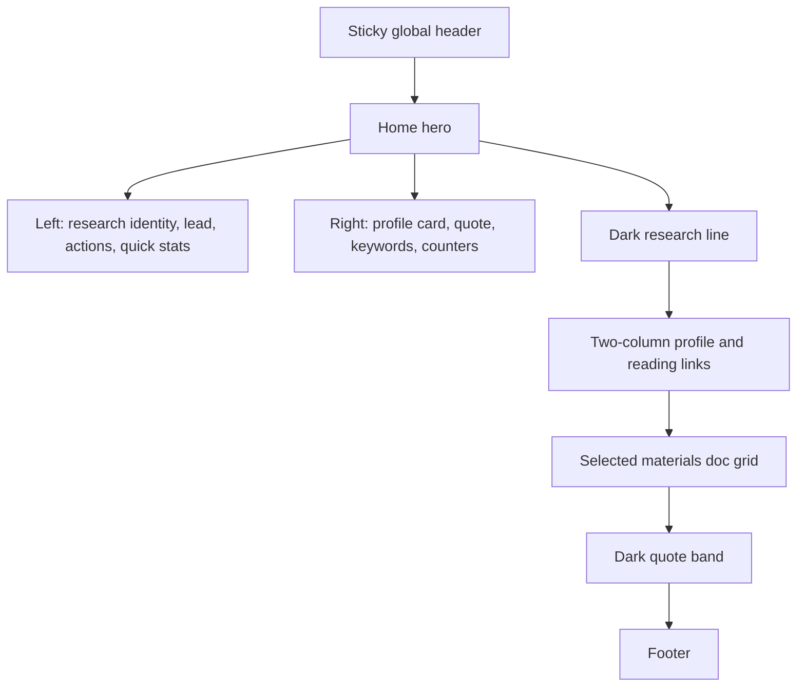
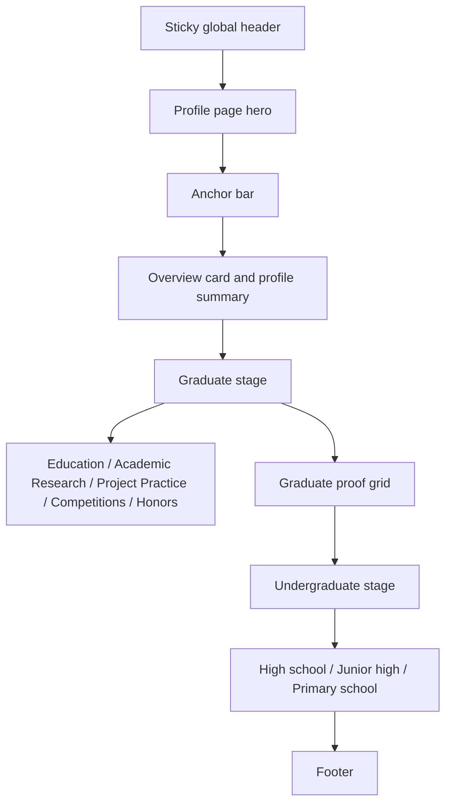
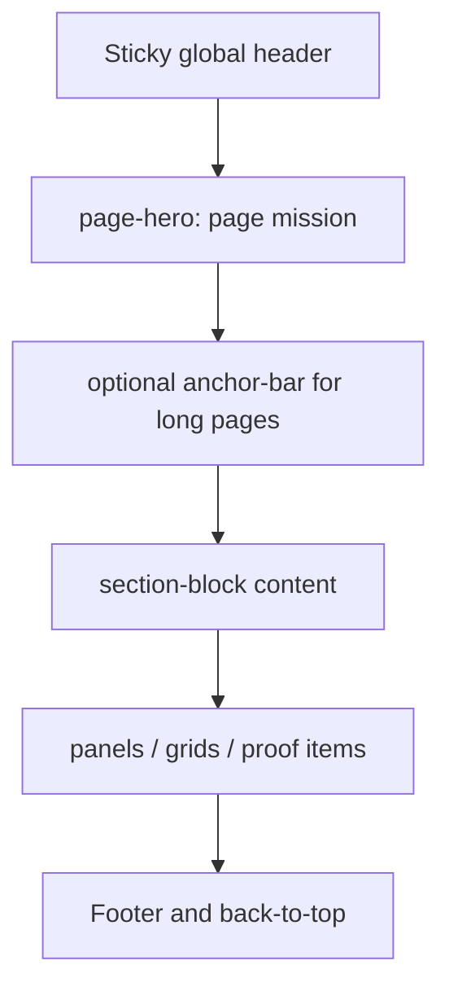
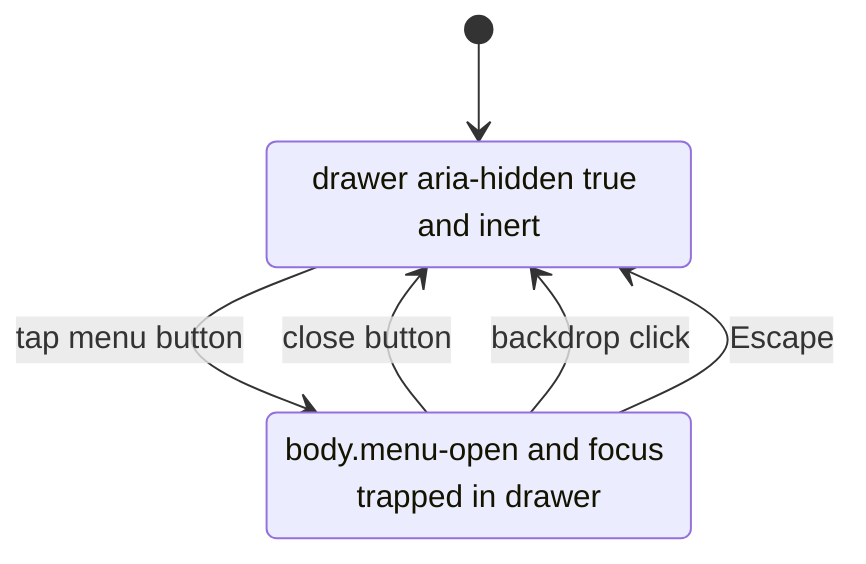
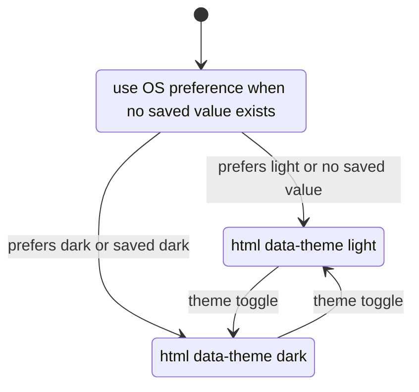
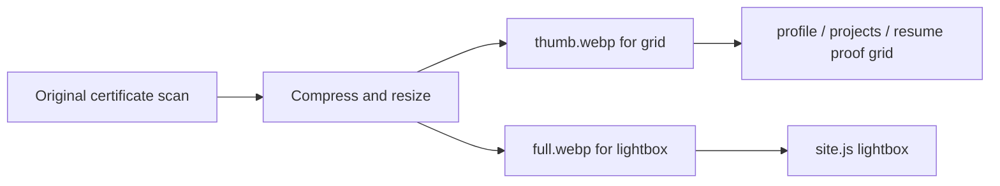

# 闫士博个人主页设计合同

本文是当前个人主页的设计合同，用于约束页面视觉、信息结构、组件行为、响应式规则、双语同步和证据材料展示。它回答三个问题：

1. 这个网站应该呈现什么气质。
2. 每类页面和组件应该如何设计。
3. 后续维护时哪些设计约束不能被破坏。

具体 CSS 写法见 `docs/design/style_guide.md`，站点架构见 `docs/design/architecture.md`，历史问题和防退化规则见 `docs/design/issues_and_fixes.md`，测试要求见 `docs/design/testing.md`。

---

## 1. 设计定位

本站定位为 **research portfolio / academic profile site**，不是营销落地页，也不是纯粹的在线简历。

第一屏必须直接传达：

- **身份**：闫士博 / ShiBo Yan，西南大学软件工程硕士研究生。
- **研究方向**：随机系统、Reach-Avoid 控制、形式化验证、安全关键系统的可验证控制。
- **可信证据**：成绩、奖项、论文进展、项目经历、PDF、证明图和项目仓库。
- **下一步动作**：查看研究方向、查看个人档案、查看项目、下载简历或联系本人。

设计上应避免以下方向：

- 不做营销式大 Hero。
- 不用抽象插画替代真实材料。
- 不堆装饰性渐变球、浮动粒子或大面积氛围图。
- 不把所有履历、证明和研究内容挤进首页。
- 不用夸张动画或复杂交互证明“技术感”。

网站的可信度来自 **清晰的信息架构 + 可验证材料链 + 克制的视觉表达**。

---

## 2. 页面设计职责

当前站点采用中文根目录和英文 `en/` 镜像页面。每个页面有明确职责，不应相互替代。

| 页面 | 设计职责 | 不应该承担 |
| --- | --- | --- |
| `index.html` / `en/index.html` | 建立第一印象，说明研究身份、研究主线和关键入口 | 不堆完整履历，不放全部证明图 |
| `profile.html` / `en/profile.html` | 按阶段展示教育、科研、项目、竞赛、荣誉和证明材料 | 不写成研究方法说明书 |
| `research.html` / `en/research.html` | 解释随机系统、Reach-Avoid、SAC、PAC、SBC、SOS / SDP 方法链 | 不重复大量奖项和个人经历 |
| `projects.html` / `en/projects.html` | 展示系统项目、仓库、技术栈、角色和项目证明 | 不替代档案页的完整时间线 |
| `resume.html` / `en/resume.html` | 快速投递、PDF 预览、下载简历和材料 | 不替代 PDF 简历本身 |
| `analytics.html` / `en/analytics.html` | 展示公开访问计数和当前浏览器本地记录 | 不把统计结果解释成真实访客画像 |
| `404.html` / `en/404.html` | 说明页面不存在并引导返回 | 不参与搜索收录，应 `noindex` |

---

## 3. 视觉原则

### 3.1 真实材料优先

证书、成绩单、项目截图、头像照片和 PDF 预览是主要视觉资产。它们承担“可信度证明”功能，比装饰图更重要。

设计时应保证：

- 证明图清楚、可点击放大。
- PDF 和成绩单入口明显。
- 项目和证书说明能被快速扫读。
- 图片不因过度压缩而影响证据可读性。

### 3.2 信息密度适中

页面需要有学术主页的信息密度，但不能变成大段履历堆叠。卡片应利于扫描：

- 一张卡片只处理一个主题。
- 标题、时间、角色、技术栈、证明材料分层呈现。
- 长文本优先拆成短句或条目。
- 项目描述只保留目标、方法、职责和证据，不写成项目报告。

### 3.3 中性优先，强调克制

页面整体应读作：

```text
白色 / 纸灰 / 近黑深色研究区 / 蓝色行动色 / 青色研究结构色
```

蓝色用于链接、按钮和当前状态。青色用于研究结构、标签、kicker、局部强调。暖色只用于梁启超诗句、证据强调或少量引用气质，不应泛滥。

### 3.4 中英文体验平行

英文页不是附属页。中英文页面应保持：

- 页面数量对应。
- 导航结构对应。
- 核心内容结构对应。
- 证明图数量、顺序和路径语义尽量对应。
- 组件 class 和层级尽量一致。

允许差异：

- 中文与英文文案长度不同。
- 英文页可适度调整措辞以符合英文简历和学术主页习惯。
- 个别中文本土化材料说明可在英文页简化，但不能遗漏核心证明链。

### 3.5 移动端以触控为先

移动端不是桌面端压缩版。必须保证：

- 导航抽屉可触控。
- 按钮高度足够。
- 证明图可点击。
- 横向材料区可滑动且中心吸附。
- 长英文标题不溢出。
- 不出现全局横向滚动条。

---

## 4. 设计代币

真实来源以 `assets/css/site.css` 的 `:root` 为准。本文只记录设计含义。

| 代币 | 当前值 / 语义 | 用途 |
| --- | --- | --- |
| `--primary` | `#0066cc` | 链接、主按钮、当前状态 |
| `--primary-focus` | `#0071e3` | hover、focus、强调边线 |
| `--primary-on-dark` | `#2997ff` | 深色区行动色 |
| `--accent` | `#0f766e` | 研究结构、kicker、标签图标 |
| `--accent-soft` | 浅青绿色表面 | 图标框、轻强调背景 |
| `--warm` | 暖色文本 | 引用、诗句、特殊强调 |
| `--warm-soft` | `#fff6e3` | 梁启超诗句与暖色证据表面 |
| `--ink` | `#1d1d1f` | 主文本 |
| `--ink-muted-80` | 次级文本 | 说明、元信息 |
| `--ink-muted-48` | 弱化文本 | 日期、辅助说明 |
| `--hairline` | `#d2d2d7` | 1px 边线 |
| `--canvas` | `#ffffff` | 主卡片和浅色画布 |
| `--canvas-parchment` | `#ececee` | 页面纸灰背景 |
| `--surface-pearl` | `#f5f5f7` | 轻表面 |
| `--surface-tile-1` | `#272729` | 深色研究区 |
| `--surface-tile-2` | `#2a2a2c` | 深色卡片 |
| `--radius-sm/md/lg` | `8px` | 卡片圆角 |
| `--radius-pill` | `9999px` | 按钮、标签、胶囊 |
| `--max-width` | `1440px` | 大内容轨道 |
| `--text-width` | `980px` | 阅读型内容轨道 |
| `--header-h` | `44px` | 粘性导航高度 |
| `--section-space` | `80px` | 大板块节奏 |
| `--card-space` | `24px` | 卡片内边距 |

深色主题使用 `:root[data-theme="dark"]` 覆盖设计代币。新增颜色必须同时检查浅色和深色主题，不允许只在浅色主题下成立。

---

## 5. 排版合同

### 5.1 字体策略

当前站点采用本地 Inter 字体文件和系统中文字体栈。`@font-face` 规则写在 `assets/css/site.css` 顶部，不再单独引用 `fonts.css`，也不依赖 Google Fonts。

字体原则：

- 英文和数字优先使用 Inter / SF Pro 系列。
- 中文使用系统中文字体栈。
- 不在单个页面中引入新字体。
- 不使用远程字体 CSS。
- `font-display: swap` 保证字体加载不阻塞首屏。

### 5.2 字号与行高

- 正文默认 `17px`，`line-height: 1.47`。
- Hero 标题桌面约 `56px`，移动端降到约 `34px`，极窄屏继续压缩。
- Section 标题桌面约 `40px`，移动端约 `34px` 或 `30px`。
- 卡片正文不应小于 `14px`。
- 英文长标题应允许换行，不靠缩小到不可读解决。

### 5.3 字距

全站 `letter-spacing` 默认保持 `0`，包括中文、英文、按钮、导航和标签。

不要为了“高级感”给中文大面积加字距。中文加字距会降低阅读效率。

---

## 6. 品牌与图标合同

### 6.1 Favicon

`assets/icons/site.ico` 是全站 favicon。它承担浏览器标签栏身份识别功能，不承载完整研究叙事。

favicon 的设计原则：

- 16×16 下必须清楚。
- 主符号数量最多一个。
- 辅助色最多一个。
- 不使用细线、虚线、复杂路径或小文字。
- 深色标签栏和浅色标签栏都要可见。

如果后续继续升级 favicon，建议补齐：

```text
assets/icons/favicon.svg
assets/icons/apple-touch-icon.png
assets/icons/icon-192.png
assets/icons/icon-512.png
```

并同步更新 `manifest.webmanifest`。

### 6.2 顶部 brand-mark

顶部 `brand-mark` 由 CSS 使用图片资源注入：

```text
assets/icons/brand-mark.png
```

它是站点级个人标识，不能再当作普通 Font Awesome 图标处理。不要把它和研究页中的语义图标混为一处修改。

设计要求：

- 在 16px 尺寸下可识别。
- 与 favicon 视觉语言一致。
- 在黑色粘性导航条上清楚可见。
- 不额外加复杂阴影、边框或动画。

### 6.3 功能图标

功能图标继续使用本地 Font Awesome 4.7，主要用于：

- 导航抽屉按钮。
- 邮箱、GitHub、PDF、返回顶部。
- 卡片中的辅助视觉提示。

功能图标只作为辅助，不替代文字标签。

---

## 7. 页面节奏

### 7.1 首页节奏

首页只承担入口和判断价值，不承载完整履历。推荐节奏：

1. **双色分割 Hero**：左侧研究身份、说明文字、行动按钮和快速数据；右侧个人名片、诗句、关键词、访问统计。
2. **深色研究线**：解释从规格、学习、近似到验证的研究路径。
3. **双列摘要**：简历线索和主要阅读入口。
4. **主要材料**：成绩单、证书、项目入口或关键材料。
5. **深色 quote band**：用引用或简短理念收束页面。

### 7.2 档案页节奏

档案页是完整证明链，按阶段组织。

研究生阶段推荐顺序：

```text
教育经历
学术科研
项目与实践
比赛情况
荣誉奖项
研究生阶段证明
```

原因：

1. 先确定身份。
2. 再说明当前科研产出和论文进展。
3. 再展示工程项目与实践。
4. 最后用竞赛、荣誉和证明图支撑可信度。

本科、高中、初中、小学阶段继续以教育经历、荣誉奖项、校园/项目经历、证明材料为主。

### 7.3 研究页节奏

研究页应展示方法链，而不是履历。建议顺序：

```text
问题设定
Reach-Avoid 规格
强化学习控制器
PAC / 多项式近似
SBC / SOS / SDP 验证
迭代改进与研究边界
```

不要把论文进展、奖项和个人经历大量放进研究页。它们应主要出现在档案页或简历页。

### 7.4 项目页节奏

项目页展示系统项目和工程证据。每个项目至少包含：

- 项目名称。
- 时间。
- 角色。
- 技术栈。
- 核心场景。
- 仓库或材料链接。
- 证明图片或截图。

如果未来把“视觉端到端强化学习避障小车”扩展为正式项目页，应使用同一项目卡片结构，而不是只在档案页临时扩写。

### 7.5 简历页节奏

简历页服务投递和快速核查：

- 顶部给出身份、联系方式、关键词。
- 明确提供 PDF 简历下载。
- 提供成绩单和证明材料入口。
- iframe 预览失败时必须有 fallback 链接。
- 不替代 PDF 简历，不应写得比完整档案页更长。

### 7.6 统计页节奏

统计页只解释“公开统计”和“本地浏览记录”的区别：

- 公开计数来自第三方服务，可能失败。
- 本地记录只存在当前浏览器。
- 统计失败不能影响页面核心内容。
- 不把 PV / UV 解释成严格真实访客画像。

---

## 8. 组件合同

### 8.1 全局导航

桌面导航是高度约 44px 的黑色粘性条。

约束：

- 当前页使用 `aria-current="page"`。
- 当前页视觉状态可以用底部蓝线或色彩强调，不用字体跳动。
- 导航不应换行挤压品牌区。
- 移动端在 `max-width:833px` 切换为抽屉。
- 品牌文本过长时用省略号，不撑破导航。

### 8.2 移动端抽屉

抽屉打开时：

- `body` 应有 `menu-open` 状态。
- 抽屉可见，背景遮罩可点击关闭。
- 焦点被限制在抽屉内。
- Escape 可以关闭。
- 背景内容不可聚焦。

抽屉关闭时：

- 抽屉 `aria-hidden="true"`。
- 抽屉设置 `inert`。
- 返回触发按钮或合理焦点位置。
- 页面普通链接恢复可点击。

### 8.3 按钮

按钮分为主按钮和次按钮：

- 主按钮用于“查看简历、查看研究、下载”等主动作。
- 次按钮用于辅助跳转。
- 最小触控高度不低于 44px。
- 文案必须明确，不使用“了解更多”作为唯一文本。
- 图标只能辅助文字，不单独承担语义。

### 8.4 标签与关键词

标签用于快速表达研究关键词、技术栈和状态。

要求：

- 单个标签不宜过长。
- 标签数量应克制，避免整页变成标签云。
- 中文和英文标签应同步语义。
- 技术栈标签应优先写核心技术，不堆所有工具。

### 8.5 卡片

卡片用于重复条目、信息面板、项目、材料、统计和证明。

要求：

- 圆角统一 8px。
- 边框 1px。
- hover 只做轻微上浮或边框变化。
- 不用强阴影制造漂浮感。
- 不把整页所有内容都包进大卡片。

### 8.6 学术科研卡片

`profile.html` 的“学术科研”是研究生阶段核心卡片。写法应保持简历式、可核查：

推荐结构：

```text
国家自然科学基金项目参与
一作论文在投
二作论文在投
论文准备中
学术训练
```

写作边界：

- 已发生内容写具体。
- 在投论文可写“在投”。
- 未投稿计划不写具体会议，除非用户明确需要公开。
- CCF 分类可写，但需确保和使用版本一致。
- 不夸大论文状态，不把“准备中”写成“即将录用”。

### 8.7 项目与实践 mini-card

`profile.html` 中的“项目与实践”可以使用专门的 mini-card，而不是普通 `ul`。

约束：

- 项目标题、时间、技术栈、描述、主要工作分层。
- 样式写在 `site.css`，使用 `profile-project-*` 类。
- 不在 HTML 中写 `style=""`。
- 同类项目继续复用该组件。
- 如果项目内容变多，应迁移到 `projects.html`，档案页只保留摘要。

### 8.8 证明图

证明图片是证据链核心组件。

基础要求：

- 使用真实图片。
- `` 必须有 `alt`。
- 必须写 `width` 和 `height`。
- 非首屏图加 `loading="lazy"` 和 `decoding="async"`。
- 可放大查看的证明图加 `data-lightbox`。
- `data-caption` 应和图片内容一致。

研究生阶段证明图建议使用双文件策略：

```text
thumb.webp  用于页面缩略图
full.webp   用于 lightbox 大图
```

普通证明图如果文件不大，可以继续直接引用原图。但新增证明图应优先采用压缩版本，不应直接把几十 MB 原图放进页面加载路径。

### 8.9 Lightbox

Lightbox 用于证明图和项目证据。

要求：

- 打开后能通过 Escape 关闭。
- 点击遮罩能关闭。
- 关闭后恢复焦点。
- 图片说明应来自 `data-caption`。
- 不应阻塞页面滚动状态恢复。

### 8.10 深色研究区

深色区用于研究主线、quote band 或重点结构说明。

要求：

- 背景使用深色 token。
- 文字使用深色区专用颜色。
- 链接和按钮使用 `--primary-on-dark` 或对应深色变量。
- 状态提示、标签、卡片不能沿用浅色样式导致对比度不足。

### 8.11 统计卡片

统计卡片展示公开计数和本地记录。

要求：

- 公开统计失败时显示 `warn` 状态。
- 本地记录仍可工作。
- 计数加载不应阻塞首屏。
- 统计状态在浅色和深色主题下都必须可读。
- 不把第三方统计失败显示成页面错误。

### 8.12 PDF 预览

简历页的 PDF iframe 是增强功能，不是唯一访问路径。

要求：

- iframe 上方或旁边必须有直接下载 / 打开按钮。
- iframe 加载失败时 fallback 文案和链接仍可用。
- 移动端不强迫用户在很小窗口内阅读 PDF。

---

## 9. 响应式规则

当前主要断点：

| 断点 | 行为 |
| --- | --- |
| `min-width:1069px` | Hero 双列，左右边缘对齐 1440px 内容轨道 |
| `max-width:1068px` | Hero 单列，三/四列网格降为两列 |
| `max-width:833px` | 桌面导航隐藏，移动抽屉启用 |
| `max-width:640px` | 内容左右约 16px，主要网格单列，Hero 侧栏改横向滑动 |
| `max-width:419px` | 标题、大数字、按钮和卡片进一步压缩 |

### 9.1 宽屏

宽屏重点是对齐，不是无限拉宽。

要求：

- Hero 左右外边缘与下方 `section-block` 内容轨道对齐。
- 内容最大轨道使用 `--max-width:1440px`。
- 阅读型内容不超过 `--text-width:980px`。
- 1920px 和 2560px 下不应出现内容散开。

### 9.2 平板与窄桌面

要求：

- 多列网格逐步降列。
- 导航在拥挤前切换成移动抽屉。
- 卡片间距不能因为压缩变得过密。
- 英文长标题允许换行，不撑破卡片。

### 9.3 手机

要求：

- 不出现全局横向滚动条。
- Hero 侧栏横向 rail 使用中心吸附。
- 按钮触控面积足够。
- 证明图可点击，caption 不溢出。
- sticky header 不遮挡 anchor 跳转目标。

---

## 10. 主题设计

站点支持浅色 / 深色主题切换。

状态机制：

- `assets/js/site.js` 操作 `<html>` 的 `data-theme`。
- 本地存储键为 `ysb-theme`。
- 没有保存值时跟随系统偏好。
- CSS 使用 `:root[data-theme="dark"]` 覆盖变量。

主题设计要求：

- 深色主题不是简单反色。
- 所有卡片、状态提示、标签、按钮和证明图 caption 都要检查对比度。
- `status-note[data-state]` 这类状态组件必须单独检查深色主题。
- 不允许新增只在浅色主题可读的颜色。
- 新增组件时必须同时看浅色和深色。

---

## 11. 可访问性合同

必须保留：

- skip link。
- 正确的 `<html lang>`。
- 语义化 `<header>`、`<main>`、`<section>`、`<article>`、`<footer>`。
- 导航和抽屉的 `aria-label`。
- 当前页 `aria-current="page"`。
- 图片 `alt`。
- 按钮的可访问名称。
- 抽屉和 lightbox 的焦点陷阱。
- 返回顶部按钮隐藏时不可聚焦。
- `prefers-reduced-motion` 支持。
- 不只靠颜色表达状态。

新增交互组件时，必须回答：

1. 键盘能不能打开。
2. 键盘能不能关闭。
3. 焦点是否可控。
4. 屏幕阅读器是否能理解。
5. 移动端触控目标是否足够。

---

## 12. 内容写作规则

### 12.1 总体文风

本站文案应采用研究型个人主页风格：

- 准确。
- 克制。
- 可核查。
- 不夸大。
- 不营销。
- 不使用空泛套话。

避免：

- “赋能”“引领”“打造闭环生态”等营销表达。
- “极致”“完美”“震撼”等夸张词。
- 没有证据支撑的能力断言。
- 过度 AI 化的长段落。

### 12.2 首页文案

首页标题要短，说明文字要解释具体研究价值。

推荐表达方向：

```text
学习控制器。证明安全。
随机系统 · Reach-Avoid 控制 · 形式化验证
```

不推荐：

```text
探索未来科技，赋能智能世界
```

### 12.3 学术科研文案

原则：

- 论文状态写清“在投”“准备中”“已录用”“已发表”。
- 作者身份写清“一作”“二作”“导师一作，本人二作”等，但不要造成过度解释。
- 基金项目写清项目类型、题目、编号和周期。
- 未发生的投稿计划谨慎公开。

### 12.4 项目文案

项目文案要讲：

- 目标。
- 方法。
- 角色。
- 技术栈。
- 证据或成果。

不要把项目页写成代码说明书，也不要把实验细节写得像论文方法章节。

### 12.5 英文文案

英文页应是自然英文，不是中文逐字翻译。

要求：

- 使用 academic profile / portfolio 常见表达。
- 保留技术术语准确性。
- 避免过长从句堆叠。
- 会议、期刊、项目名称用斜体或合适格式。
- 中文本土化材料可解释而不是硬译。

---

## 13. 图片与材料设计

### 13.1 图片命名

所有新增图片：

- 小写英文。
- 使用连字符。
- 不用中文。
- 不用空格。
- 文件名体现语义。

示例：

```text
huawei-cup-2025-thumb.webp
academic-innovation-2025-full.webp
social-practice-2026-thumb.webp
```

### 13.2 文件大小

建议：

| 类型 | 建议大小 |
| --- | --- |
| 缩略图 | 40–120 KB |
| Lightbox 大图 | 100–900 KB |
| 普通证书图 | 尽量小于 500 KB |
| PDF | 在可读前提下控制体积 |
| favicon / brand icon | 小尺寸清晰优先 |

不应把几十 MB 原图直接作为 ``。

### 13.3 证明图 thumb / full 策略

研究生阶段证明图建议统一放在：

```text
assets/images/proofs/
```

命名：

```text
xxx-thumb.webp
xxx-full.webp
```

HTML：

```html
<a class="proof-item" data-lightbox data-caption="证明说明" href="./assets/images/proofs/xxx-full.webp">
  
  <div class="proof-caption">
    <strong>证明标题</strong>
    <span>年份和说明</span>
  </div>
</a>
```

英文页路径改为：

```text
../assets/images/proofs/xxx-full.webp
../assets/images/proofs/xxx-thumb.webp
```

### 13.4 头像与 OG 图

头像路径：

```text
assets/profile/photo.jpg
```

它被首页、档案页、简历页、OG 图和 JSON-LD 引用。替换头像时优先保持文件名不变。

---

## 14. 统计设计

统计不是核心内容。统计设计的目标是“有则显示，无则降级”。

### 14.1 统计加载

原则：

- 不在 HTML 中直接同步加载第三方统计脚本。
- 第三方统计脚本应由 `stats.js` 在 `window.load` 后懒加载。
- 统计失败不阻塞页面。
- 首页和统计页可以展示统计；其他页面不必加载 `stats.js`。

### 14.2 统计状态

状态至少包括：

- 加载中。
- 成功。
- 部分成功。
- 不可用 / warn。

所有状态必须在浅色和深色主题下可读。

### 14.3 本地记录

本地浏览记录只代表当前浏览器，不代表真实访问量。统计页文案必须避免误导。

---

## 15. 双语平行设计合同

修改中文页时必须同步检查英文页。

必须同步：

- 导航。
- 页脚。
- 页面结构。
- 主要卡片。
- 证明图数量和顺序。
- 下载链接。
- canonical / hreflang。
- JSON-LD。
- sitemap。

允许不同：

- 文案自然表达。
- 英文标题换行。
- 个别中文材料说明做解释性翻译。
- 英文页面日期格式使用英文习惯。

禁止：

- 中文页新增模块，英文页完全没有对应结构。
- 中文页证明图增加，英文页长期缺失。
- 中文页导航更新，英文页导航不更新。
- 只更新页面正文，不更新 `<head>` 元数据。

---

## 16. 禁止破坏的设计不变量

后续任何修改都不能破坏以下约束：

1. 中英文路由结构一一对应。
2. 共享视觉规则只写在 `assets/css/site.css`。
3. 不新增 HTML 内联样式。
4. 不引入需要构建工具才能运行的框架。
5. 不引入远程字体 CSS。
6. `brand-mark` 使用 `assets/icons/brand-mark.png`，不要退回 Font Awesome terminal 字符。
7. 主题状态使用 `data-theme` 和 `ysb-theme`。
8. 移动抽屉关闭时必须不可聚焦。
9. 证明图必须有 `alt`、尺寸和懒加载属性。
10. 新增或改名页面必须更新 `scripts/generate-sitemap.js` 并重新生成 `sitemap.xml`。
11. 统计失败不能影响核心内容阅读。
12. 不用正则解析嵌套 HTML 后再整体重写页面。
13. 不用 `git restore/reset` 覆盖用户未提交工作。
14. 不把私人联系方式和证明材料无边界扩大公开范围。

---

## 17. 页面设计图

### 17.1 首页布局



### 17.2 档案页布局



### 17.3 内页模板



### 17.4 移动端抽屉状态图



### 17.5 主题状态图



### 17.6 证明图资源流



---

## 18. 当前设计债务与检查项

这些不是全部缺陷，而是当前项目后续设计维护时应重点检查的地方。

### 18.1 英文证明图同步

中文档案页新增证明图后，英文档案页应同步数量、顺序和路径语义。不同步会破坏双语平行体验。

### 18.2 404 页面

404 页面应包含：

```html
<meta name="robots" content="noindex">
```

中文和英文 404 都要检查。

### 18.3 统计 preconnect

如果某页面不展示统计，不应保留无意义的统计域名 preconnect。首页和统计页可以根据性能策略决定是否保留。

### 18.4 README 与文档措辞

README、architecture、design、testing、issues_and_fixes 中关于字体、图标、统计脚本、证明图路径的描述必须与当前实现一致。

### 18.5 行尾格式

提交前必须保证 `git diff --check` 通过。不要让 CRLF / LF 混乱造成整文件无意义 diff。

---

## 19. 修改前设计检查清单

修改页面前先问：

1. 这个内容应该在首页、档案页、研究页、项目页还是简历页？
2. 中文页和英文页是否都要改？
3. 是否需要改 sitemap？
4. 是否需要改 JSON-LD、OG 或 Twitter 元数据？
5. 是否新增了图片、PDF 或图标？
6. 新资源是否压缩、命名规范、路径正确？
7. 是否破坏深色主题？
8. 是否破坏移动端布局？
9. 是否引入内联样式？
10. 是否让统计、字体或第三方脚本阻塞首屏？
11. 是否需要更新 `docs/design/testing.md` 或 `issues_and_fixes.md`？

---

## 20. 设计验收标准

一次页面设计改动至少应满足：

```bash
node --check assets/js/site.js
node --check assets/js/stats.js
node --check scripts/generate-sitemap.js
node scripts/generate-sitemap.js
git diff --check
```

人工检查至少覆盖：

- 1366px 桌面。
- 390px 手机。
- 浅色主题。
- 深色主题。
- 中文页面。
- 英文页面。
- 受影响页面的 lightbox。
- 受影响页面的导航和语言切换。
