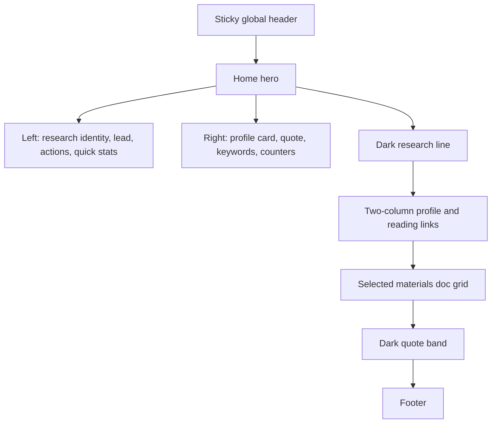
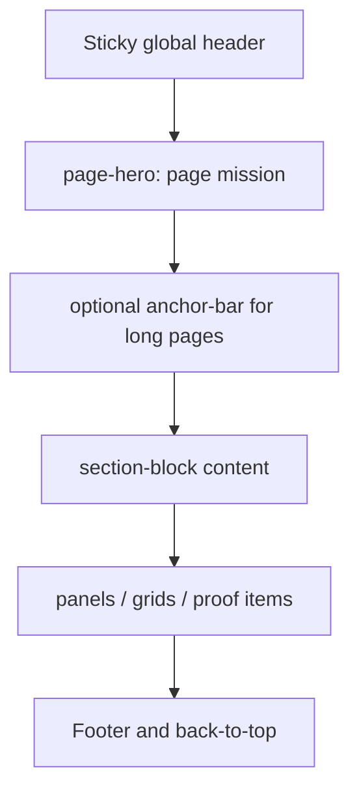
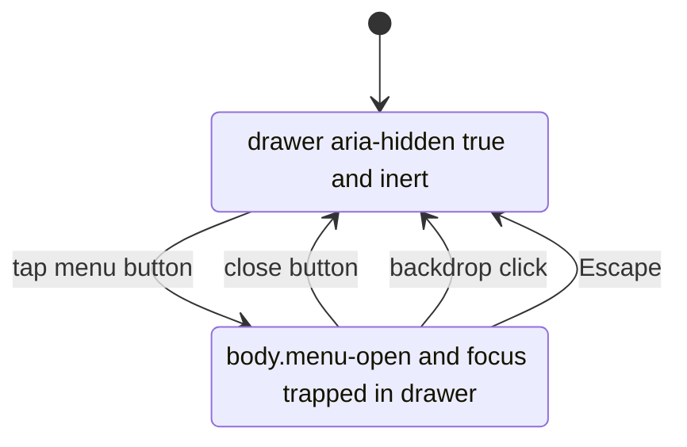
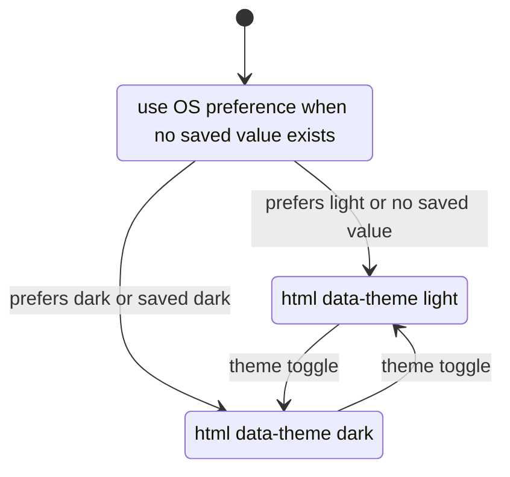

# 闫士博个人主页设计合同

本文是当前网站的设计合同。它回答“这个网站应该长什么样、为什么这样设计、改动时不能破坏什么”。具体 CSS 写法见 `docs/design/style_guide.md`，历史问题见 `docs/design/issues_and_fixes.md`。

## 1. 设计定位

本站定位为 research portfolio。第一屏必须直接传达：

- 姓名和当前身份。
- 研究方向：随机系统、reach-avoid 控制、形式化验证。
- 可验证证据：成绩、奖项、PDF、项目仓库和证明图。
- 下一步动作：看研究、看简历、看项目。

不做营销式大 Hero，不做抽象插画，不使用装饰性渐变球或大面积单色氛围图。

## 2. 视觉原则

1. 真实材料优先。证书、成绩单、项目证明和头像照片是主视觉资产。
2. 信息密度适中。卡片要利于扫描，不为装饰牺牲可读性。
3. 颜色先中性，后强调。页面整体应读作白、纸灰、深色研究区，蓝色和青色只做信号。
4. 中英文体验平行。英文页不是附属页，结构、节奏和可用性必须一致。
5. 移动端以触控为先。菜单、按钮、证明图片和横向材料区都要有明确触控目标。

## 3. 设计代币

真实来源在 `assets/css/site.css` 的 `:root`。

| 代币 | 值 | 用途 |
| --- | --- | --- |
| `--primary` | `#0066cc` | 链接、主按钮、当前状态 |
| `--primary-focus` | `#0071e3` | 焦点和 hover |
| `--primary-on-dark` | `#2997ff` | 深色区行动色 |
| `--accent` | `#0f766e` | 研究结构、标签图标、kicker |
| `--warm-soft` | `#fff6e3` | 梁启超诗句和暖色证据表面 |
| `--canvas` | `#ffffff` | 主卡片和浅色画布 |
| `--canvas-parchment` | `#ececee` | 纸灰背景 |
| `--surface-tile-1` | `#272729` | 深色研究区 |
| `--icon-surface` | `rgba(15,118,110,.1)` | 图标框浅色表面 |
| `--icon-border` | `rgba(15,118,110,.22)` | 图标框边线 |
| `--hairline` | `#d2d2d7` | 1px 边线 |
| `--radius-lg` | `8px` | 卡片圆角 |
| `--radius-pill` | `9999px` | 按钮和标签 |
| `--max-width` | `1440px` | 大内容轨道 |
| `--text-width` | `980px` | 阅读型内容轨道 |

## 4. 排版

- 字体栈使用 `--font-sans` 和 `--font-display`，不要在局部页面引入新字体栈。
- 正文默认 17px，line-height 1.47。
- Hero 标题桌面 56px，移动端降到 34px，再窄时 28px。
- Section 标题桌面 40px，移动端 34px 或 30px。
- 全站 `letter-spacing` 为 `0`，包括中文、英文、按钮和导航。
- 不使用随视口宽度无限缩放的字体。

## 5. 页面节奏

主页节奏：

1. 双色分割 Hero：左侧研究身份，右侧个人名片、诗句、关键词和访问统计。
2. 深色研究线：解释从规格、学习到求证的流程。
3. 双列摘要：简历线索和阅读入口。
4. 主要材料：成绩单、证书、项目入口。
5. 深色 quote band：收束页面。

内页节奏：

1. `page-hero` 给出页面任务。
2. 主内容使用 `section-block` 分段。
3. 长页使用 `anchor-bar`。
4. 证明图片使用 `proof-grid` 和 lightbox。

## 6. 组件合同

### 导航

桌面导航是 44px 高黑色粘性条，当前页用底部蓝线表示，不用加粗跳动。移动端用右侧抽屉，抽屉关闭时保持 `inert`。

左上角 `brand-mark` 使用 Font Awesome terminal 图标 `\f120`，由 CSS 注入。它代表计算机科学、系统控制和形式化验证工具链，不再使用早期的烧瓶图标。favicon 也使用自定义终端验证图标，与品牌标识保持一致。

### 按钮

主按钮使用蓝色胶囊，次按钮使用浅色或透明胶囊。按钮最小高度 44px，图标来自 Font Awesome 4.7。

### 卡片

卡片只用于重复条目、信息面板、项目、材料、统计和证明。圆角统一 8px，边框 1px，hover 只做轻微上浮。

### 证明图

证明图片必须是真实图片，不用抽象占位。所有图片写明 `alt`、`width`、`height`、`loading` 和 `decoding`。点击大图通过 `data-lightbox` 进入 lightbox。

### 深色区

深色区用于研究主线和 quote band。文字必须使用深色区专用颜色，不允许浅色状态样式直接泄漏到深色背景。

### 统计卡片

公开统计失败时显示 `warn` 状态，本地记录仍工作。状态文案颜色必须在浅色和深色主题下都可读。

## 7. 响应式规则

| 断点 | 行为 |
| --- | --- |
| `min-width:1069px` | Hero 双列，左右边缘对齐 1440px 轨道 |
| `max-width:1068px` | Hero 单列，三/四列网格降为两列 |
| `max-width:833px` | 桌面导航隐藏，移动抽屉启用 |
| `max-width:640px` | 内容左右 16px，主要网格单列，Hero 侧栏改横向滑动 |
| `max-width:419px` | 标题和大数字进一步压缩，主按钮可满宽 |

移动端 Hero 侧栏使用中心吸附，不使用左边缘吸附。证明图片如果被改成横向滑动，必须明确覆盖目标 `proof-grid` 变体。

## 8. 可访问性

- 保留 skip link。
- 导航和抽屉有准确 `aria-label`。
- 当前页使用 `aria-current="page"`。
- 抽屉、lightbox 打开时启用焦点陷阱，关闭后恢复焦点。
- 返回顶部按钮隐藏时不可聚焦。
- 尊重 `prefers-reduced-motion`。
- 不能只靠颜色表达状态。

## 9. 内容写作规则

- 首页标题短，说明文字解释具体研究价值。
- 研究页写方法链，避免堆履历。
- 项目页写角色、技术栈、场景和证据。
- 档案页写时间线和证明材料，不把所有内容挤回主页。
- 简历页写可投递信息，不替代 PDF。

## 10. 页面设计图

### 10.1 首页布局

### 10.2 内页模板

### 10.3 移动端抽屉状态图

### 10.4 主题状态图

