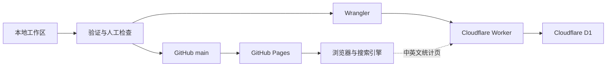

# 运维指南

本文是本地预览、sitemap、发布、线上核验、缓存、回滚和公开材料处置的唯一操作说明。测试命令见[测试规范](testing.md)，架构合同见[架构文档](architecture.md)，当前维护队列见[维护记录](maintenance.md)。

## 1. 运行与发布模型

项目有两个独立发布面：仓库 `main` 中的 HTML、CSS、JavaScript 和资源由 GitHub Pages 直接发布；`worker/` 中的访问统计 API 由 Wrangler 发布到 Cloudflare Worker，并使用 D1 保存聚合值：



文档、资源和 Markdown 位于公开仓库时都应视为公开，即使站内导航没有链接。

## 2. 本地预览

从仓库根目录启动：

```powershell
python -m http.server 8000
```

浏览：

```text
http://127.0.0.1:8000/
http://127.0.0.1:8000/en/
```

预览结束后在原终端按 Ctrl+C。若端口已占用，先确认占用进程；不要随意结束不属于本项目的服务。

`python -m http.server` 不会模拟 GitHub Pages 的自定义 404：缺失路径会显示 Python 自带错误页。验证根 `404.html` 对深层中文与 `/en/...` 缺失路径的真实 fallback、HTTP 404、URL 保留和资源解析时，从仓库根目录运行以下只读 handler；不能把普通预览服务器结果当作 Pages 行为：

```powershell
$serverCode = @'
from functools import partial
from http.server import ThreadingHTTPServer, SimpleHTTPRequestHandler
from pathlib import Path

ROOT = Path.cwd().resolve()

class PagesHandler(SimpleHTTPRequestHandler):
    def send_error(self, code, message=None, explain=None):
        if code != 404:
            return super().send_error(code, message, explain)
        body = (ROOT / "404.html").read_bytes()
        self.send_response(404)
        self.send_header("Content-Type", "text/html; charset=utf-8")
        self.send_header("Content-Length", str(len(body)))
        self.send_header("Cache-Control", "no-store")
        self.end_headers()
        if self.command != "HEAD":
            self.wfile.write(body)

handler = partial(PagesHandler, directory=str(ROOT))
ThreadingHTTPServer(("127.0.0.1", 8000), handler).serve_forever()
'@
$serverCode | python -
```

该 handler 对存在文件保持普通 200，对缺失 GET/HEAD 返回根 404 正文和 HTTP 404，不发送 `Location`。结束方式与普通预览相同；浏览器断言按[测试规范的 404 矩阵](testing.md#77-404)执行。

需要本地验证统计后端时，先在被 `.gitignore` 排除的 `worker/.dev.vars` 中设置一次至少 32 字节的随机 `VISITOR_HASH_SECRET`，不得把值写入命令记录、文档、测试输出或仓库。随后从仓库根目录依次运行：

```powershell
npx.cmd --yes wrangler@latest d1 migrations apply DB --local --config worker/wrangler.toml
npx.cmd --yes wrangler@latest dev --config worker/wrangler.toml
```

本地 Worker 默认不替换两个统计页中已提交的生产 endpoint；可直接请求本地 URL，或在一次性浏览器测试环境中覆盖请求目标，不要为本地预览提交 endpoint 改动。真实 D1 迁移、线上 Worker 与静态页面联调属于发布检查。

## 3. Sitemap

### 3.1 何时生成

出现以下任一情况时重新生成：

- 新增、删除或改名可索引 HTML；
- 修改 canonical 或中英文页面映射；
- 修改获批的可索引 HTML 元数据或 JSON-LD，并需要用最终 HTML mtime 发布本次变更；
- 需要用当前 HTML mtime 更新 `lastmod`。

仅重写 Markdown 项目文档、CSS、JavaScript 或不影响 HTML mtime/URL 映射的资源时，不需要生成 sitemap。

### 3.2 生成

```powershell
node scripts/generate-sitemap.js
```

生成器固定处理六组中英文内容页，共 12 个 URL；404 不进入 sitemap。`lastmod` 来自本地 HTML mtime，因此多个页面日期相同是合法结果。

仅发布已批准的 HTML 元数据或 JSON-LD、且路由与语言映射未变时，生成后的 sitemap diff 只能更新有效的 `YYYY-MM-DD` `lastmod`；12 个 `loc` 及其 `zh-CN`、`en`、`x-default` alternate 集合必须保持不变。

生成后必须按[测试规范](testing.md)运行完整自动验证，并审查 `sitemap.xml` diff。不要在无页面变更时提交纯 mtime 噪声。

## 4. 发布前检查

1. 确认当前目录和分支符合本次任务。
2. 阅读 `git status --short`，区分本次改动与已有用户改动。
3. 用明确路径审查 `git diff`，不得覆盖无关文件。
4. 进行人工隐私检查：所有新增文本、图片和下载材料都已获授权公开。
5. 页面路由、canonical/语言映射或需发布的 HTML 元数据/JSON-LD 发生变化时生成 sitemap。
6. 执行[测试规范](testing.md)中的自动和适用人工检查。
7. 涉及统计后端时，确认 migration 按编号前进、Worker dry-run 通过、secret 已设置且没有进入 diff。
8. 只暂存本次确认的文件，再审查 staged diff。

禁止使用会丢失工作区改动的清理命令。共享工作区存在其他改动时，先隔离或请求确认。

## 5. 发布

只修改普通静态页面时采用普通 Git 提交流程：

1. 明确暂存文件；
2. 创建描述单一目的的提交；
3. 推送当前已确认分支；
4. 等待 GitHub Pages 完成部署；
5. 按本节线上清单核验。

新增或修改统计后端、D1 结构或两个统计页的 endpoint 时，按以下顺序发布，避免静态页面先连接到尚未就绪的 API：

1. 首次部署通过 `npx.cmd --yes wrangler@latest secret put VISITOR_HASH_SECRET --config worker/wrangler.toml` 交互式设置随机 secret；后续普通部署不重复设置。
2. 完成本地 migration、Worker dry-run、自动测试和浏览器检查，明确暂存并创建本地提交，但暂不推送引用新 endpoint 的静态页面。
3. 执行 `npx.cmd --yes wrangler@latest d1 migrations apply DB --remote --config worker/wrangler.toml`，审查实际应用的 migration。
4. 执行 `npx.cmd --yes wrangler@latest deploy --config worker/wrangler.toml`，从已经提交且验证的源部署 Worker。
5. 请求 `https://yan-shibo-site-stats.yan-shibo.workers.dev/health`，必须得到 HTTP 200、`status: ok` 和精确起始日期；确需验证一次真实写入时在归零前完成。
6. 首次公开上线前删除所有部署测试计数并确认三个公开值均为 `0`；归零后不要再发测试 `POST`，从而保证“统计始于 2026-07-22”从公开部署日干净起算。
7. 推送本地提交，等待 Pages 部署，再做不增加计数的线上资源与 `GET /v1/stats` 检查。

首次归零只用于清除上线前测试数据，命令中的三条语句必须作为同一次明确维护执行：

```powershell
npx.cmd --yes wrangler@latest d1 execute DB --remote --config worker/wrangler.toml --command "UPDATE counter_totals SET value = 0 WHERE key = 'site_views'; DELETE FROM page_views; DELETE FROM monthly_devices;"
```

随后对 `GET /v1/stats?path=/` 发送生产 Origin，确认 `siteViews`、`monthUniqueDevices` 与 `pageViews` 都是字符串 `"0"`。常规发布不得再次执行这条归零命令。

常规发布不得重写历史或强制推送。只有用户明确授权且普通提交无法满足目标时，才进入历史重写流程。

## 6. 线上核验

部署完成后至少检查：

- `/` 与 `/en/`；
- 本次修改页面及其语言对应页；
- CSS、JavaScript、品牌图、两张 manifest 安装 PNG、favicon 和本次修改资源返回成功；
- canonical、hreflang、`og:url` 指向生产域名；
- 涉及结构化数据时按[测试规范的 12 路由矩阵](testing.md#72-页面范围与结构化数据矩阵)检查：每页 `<head>` 一个活动图、正文零个，JSON 可解析，页面 type/ID/lang 正确；
- 结构化数据变更没有改变页面可见内容、布局或交互；
- 缺失中文与 `/en/...` 深层路径均返回真实 HTTP 404 且倒计时前保留原 URL；根 404 的语言、导航、manifest 和 5 秒跳转目标对应，且不进 sitemap；
- `robots.txt` 与 `sitemap.xml` 可访问；
- Worker `/health` 返回 200；两个统计页面只向批准 endpoint 发出一次 POST，响应起始日期正确，失败时显示 `--` 而本地记录仍可用；首页不加载统计客户端或发出统计请求；
- 浏览器控制台没有由本次变更引入的错误；
- 强制刷新后仍显示新版本。

涉及删除公开材料时，使用 HEAD 请求核对当前分支原始地址和 Pages 地址均返回 404，避免下载不应继续传播的内容。

仅做结构化数据或其他 `<head>` 元数据核验时，不要求打开或下载 PDF、证明图等材料；资源本身发生变化时仍必须执行对应的内容与授权检查。

## 7. 缓存

Pages 部署成功但浏览器仍显示旧内容时，按以下顺序判断：

1. 用无痕窗口或新浏览器配置访问；
2. 强制刷新并检查 Network 响应状态、ETag 和缓存来源；
3. 确认 GitHub 上目标分支确实包含新文件；
4. 确认 Pages 部署对应最新提交；
5. 直接访问具体资源 URL；
6. 等待 CDN 更新后复核。

不要通过反复修改无关文件或 sitemap 规避缓存。旧 Git SHA 的 GitHub cached view 不受普通 Pages 部署控制；涉及敏感数据时按“公开材料误提交”流程处理。

## 8. 回滚

### 8.1 普通内容或样式问题

优先创建反向提交，保留可审计历史。回滚后重新执行相关测试并验证生产 URL。

### 8.2 资源或路由问题

- 恢复文件路径或同步修改所有引用；
- 可索引路由受影响时重新生成 sitemap；
- 检查中英文映射、canonical 和缓存；
- 不要只恢复 HTML 而遗漏 CSS、图片或下载材料。

### 8.3 紧急隐私问题

先让当前公开入口失效，再评估是否需要历史重写。不得因为追求完整流程而延迟当前版本删除。

### 8.4 统计 Worker 或 D1

静态站点与统计后端独立回滚。Worker 代码故障时重新部署最后一个已验证提交中的 Worker 源；D1 migration 只向前修复，不通过删除数据库或改写已应用 migration 回滚。前端在后端不可用时会降级为 `--`，因此无需为了统计故障回滚无关页面。

secret 不做例行月中轮换：同一设备在新旧 secret 下会产生不同摘要并抬高当月估算。若发生泄露或安全事件，立即轮换优先于统计连续性，并明确记录当月口径中断；是否清空当月摘要属于破坏性维护，需要单独确认。任何日志和故障说明都不得输出 secret、原始 IP 或 User-Agent。

## 9. 故障处理

### 9.1 页面 404

检查：

- URL 与文件名大小写；
- 文件是否位于发布分支；
- 相对路径是否按当前目录计算；
- Pages 是否完成最新部署；
- 该路径是预期删除还是意外缺失；
- 缺失 URL 下 CSS、脚本和站内链接是否仍解析到站点根，而不是当前深层目录；
- pathname 是否只有在精确 `/en` 或 `/en/...` 时切换英文，倒计时前是否仍保留原 URL 和 HTTP 404。

### 9.2 样式或脚本未加载

检查 Network 状态码、相对路径、大小写、缓存和控制台语法错误。确认页面仍引用共享 `assets/css/site.css` 与 `assets/js/site.js`，不要用复制文件临时绕过根因。

### 9.3 移动抽屉异常

分别在 833px 和 834px 检查 CSS 状态，并通过页面缩放或开发者工具制造 `833px < width < 834px` 的小数 CSS 视口；此时 `matchMedia('(max-width: 833px)').matches` 应为 false，抽屉状态应已清理。再检查 `site.js` 的 `inert`、焦点、Escape、遮罩和断点监听，不要用独立的 `min-width` 谓词或只增加 z-index 掩盖状态错误。

### 9.4 Lightbox 异常

先确认普通图片链接与原图有效，再检查 `data-lightbox`、caption、覆盖层 DOM 和焦点恢复。脚本错误不能阻断原图访问。

### 9.5 统计为空

先确认统计页 `<head>` 的 endpoint meta 和 Worker preconnect 精确匹配批准地址，再在 Network 检查是否只有一次 `POST /v1/visit`、请求 JSON path 是否正确，以及响应状态和五个字段。`403` 通常表示 Origin 未获批准，`400` 表示请求体或 path 不在 Worker 兼容路径白名单，`503` 表示 Worker 配置、身份输入或 D1 不可用；先读 `/health` 区分后端健康与单次请求问题。不得为了排障记录 secret、原始 IP 或 User-Agent。

客户端只接受完整有效响应；任何失败都应让三项公开值显示 `--` 且状态为 `warn`，不能显示部分或异常文本。localStorage 本地记录应继续更新，页面主体也应保持可用。需要只读检查聚合值时使用 `GET /v1/stats?path=/` 并带生产 Origin；需要检查数据结构时用 Wrangler 只读查询，确认月度表最终只有 `period` 与 `device_hash`。CORS 不能防止伪造请求，数值异常增长应作为防刷或流量质量问题单独记录。精确值与隐私合同见[架构文档](architecture.md#6-访问统计)。

### 9.6 Sitemap 不一致

确认实际 12 个可索引文件、生成器页面清单、验证器页面清单和 `sitemap.xml` 同步。相同 `lastmod` 本身不是故障。

### 9.7 Manifest 或图标异常

区分“路径存在”“静态结构与元数据正确”和“浏览器实际安装行为”。先运行[测试规范的最小验证入口](testing.md#2-最小验证入口)：验证器会核对 14 页与两份语言 manifest 的映射、入口和精确安装 PNG 清单，同时把 `site.ico` 作为独立 HTML favicon 校验。机器检查只覆盖 PNG/ICO 的签名、IHDR、块与 entry 边界、尺寸关系，不校验 PNG CRC、像素完整解码或视觉质量；浏览器安装 UI、安装后语言入口和各尺寸显示效果仍需人工验证。

### 9.8 结构化数据异常

先运行站点验证器，使用报告中的具体页面与节点定位问题，再在 Chrome 打开同一路由检查实际活动块和控制台。不要先用搜索结果反推本地合同。

- **JSON 语法**：确认活动块位置和数量，直接检查报告页面的解析错误；修复语法后重新运行验证器，确认其他检查仍完成。
- **本地图合同**：根据[架构文档的 SEO 合同](architecture.md#8-seo-与可索引边界)核对页面身份、ID/引用、字段库存和可见证据；不要添加未批准字段来消除单个提示。
- **内容授权**：验证器通过只表示结构与当前公开 HTML 一致，不能授权新增个人事实、项目主张或研究材料；不确定时停止发布并请求内容确认。
- **搜索引擎呈现**：本地与 Chrome 检查通过不保证搜索引擎收录、特定展示形式或排名；将外部呈现问题与本地语法/合同错误分开记录。

## 10. 公开材料误提交

发现未授权或不应公开的材料时：

1. 停止继续发布和传播具体内容；
2. 搜索当前文件、页面链接、Markdown 引用、sitemap 和资源引用；
3. 先从当前树删除文件和引用，通过普通提交让 Pages 入口失效；
4. 用不下载正文的 HEAD 请求验证当前原始地址与 Pages 地址；
5. 检查文件是否存在于 Git 历史、分支、标签、PR 引用或 fork；
6. 若需重写历史，先保护未提交工作、审计受影响 refs，并获得用户明确授权；
7. 只更新含目标对象的 refs，推送前使用精确 lease 防止覆盖并发更新；
8. 对齐本地仓库，清理旧 reflog/对象并复跑测试；
9. 若旧 SHA 缓存仍可访问，说明 GitHub 服务器缓存边界；是否联系 Support 需要单独授权。

历史重写会改变后续提交 SHA，并可能被旧克隆重新污染。它不是常规删除手段。

## 11. 常见维护任务

### 修改普通文案

- 仅修改获授权页面；
- 同步核对语言对应页，但不强制机械翻译；
- 不生成 sitemap，除非 HTML mtime 需要随发布策略更新；
- 执行文案类最低验收。

### 替换图片或公开下载材料

- 发布前人工打开并确认文件内容；
- 优先保持稳定路径；
- 同步按钮、图片尺寸、alt、caption 和双语入口；
- 搜索旧文件名并确认没有孤立引用；
- 只保留明确授权公开的材料。

### 修改共享 CSS/JavaScript

- 按 14 页影响面处理；
- 检查双主题、全部关键断点与键盘交互；
- 保留无脚本或统计 API 失败时的基本可用性；
- 不在单页复制共享逻辑。

### 新增、删除或改名页面

- 同步中英文页面及导航；
- 同步 SEO、生成器和验证器页面清单；
- 重新生成 sitemap；
- 全量运行自动验证与页面人工抽样；
- 更新[架构文档](architecture.md)中的页面库存。

### 仅修改项目文档

- 不触碰 HTML、CSS、JavaScript、个人材料或 sitemap；
- 更新所有项目内路径引用；
- 扫描旧路径和重复事实；
- 运行文档类最低验收。

## 12. 发布记录

项目不在 Markdown 中维护逐日 changelog；Git 历史承担版本记录。交付说明应包含：

- 修改目的和文件；
- 实际测试证据；
- 人工检查范围；
- 未运行项和已知偏差；
- 是否发布、回滚或涉及历史重写。
